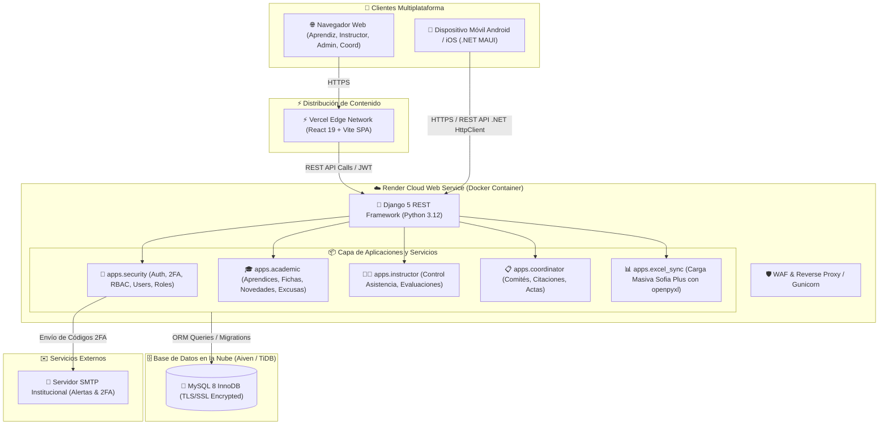
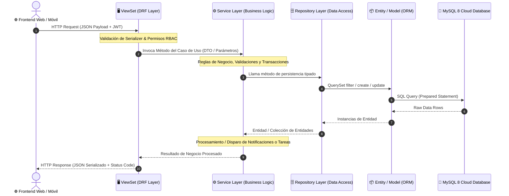

# 🏛️ Autogestión SENA — Sistema Integral de Novedades y Gestión Académica

- **Tipo:** Plataforma Web & Móvil Institucional (Fullstack Empresarial)
- **Estado:** 🟢 En Producción (Vercel Edge + Render Container + Aiven Cloud MySQL 8.4)
- **Frontend Oficial:** [autogestion-sena.vercel.app](https://autogestion-sena.vercel.app)
- **Backend API & Swagger:** [autogestion-sena-api.onrender.com/swagger/](https://autogestion-sena-api.onrender.com/swagger/)
- **Ubicación en disco:** `c:\Users\NITRO ACER\Desktop\proyectos con ia\autogestion-sena\`
- **Repositorios GitHub:**
  - 🚀 **Backend Web API:** [July173/Back-end-web-API-autogestionSena](https://github.com/July173/Back-end-web-API-autogestionSena) (Django REST Framework, MySQL, JWT, 2FA)
  - 🖥️ **Frontend Web:** [July173/autogestionFrontWeb](https://github.com/July173/autogestionFrontWeb) (React 19, TypeScript, Vite, TailwindCSS)
  - 📱 **Frontend Móvil:** [July173/FrontMovilAutogestion](https://github.com/July173/FrontMovilAutogestion) (.NET MAUI C# Multiplataforma)
- **Ramas del Proyecto:** `dev` (Desarrollo), `qa` (Staging/Validación), `main` (Producción)
- **Stack Tecnológico:** Python 3.12, Django 5.x, Django REST Framework, SimpleJWT, MySQL 8, Docker, React 19, Vite, TailwindCSS, .NET MAUI C# 12, Render Cloud, Vercel Edge
- **Relacionado:** [[00_Centro_de_Mando]], [[Autogestion SENA - Arquitectura Frontend y Hooks]], [[Clean Code y SOLID]], [[Arquitectura Limpia y Patrones de Arquitectura]], [[Blindaje Anti-Bots y Proteccion de Recursos]], [[DevOps y CI-CD (GitHub Actions, Azure, Jenkins y Despliegues)]], [[Diseno Responsivo y Adaptabilidad (Web, Mobile y TV)]]

---

## 🎯 Descripción del Proyecto
**Autogestión SENA** es una solución integral multiplataforma diseñada para transformar y digitalizar los procesos académicos, disciplinarios y administrativos del Servicio Nacional de Aprendizaje (SENA). Centraliza el registro y seguimiento de novedades de aprendices, control de asistencia en tiempo real, citación a comités de evaluación y sincronización masiva de datos institucionales desde hojas de cálculo Excel generadas en Sofia Plus.

---

## 🏗️ Arquitectura del Sistema



---

## 🏛️ Desglose Arquitectónico Profundo y Patrones de Software

### 1. 🧩 Patrón Arquitectónico en Capas del Backend (Clean Architecture / Simplified DDD)
A diferencia de los proyectos Django monolíticos tradicionales donde los controladores (`views.py`) concentran consultas SQL, serialización y reglas de negocio (*God Controllers*), en **Autogestión SENA** se implementó una **arquitectura desacoplada en 4 capas estrictas**:



#### Responsabilidad de cada Capa:
1. **`entity/models/` (Capa de Dominio y Persistencia ORM):**
   - Define el esquema relacional, tipos de campo, índices y claves foráneas.
   - Cero lógica de negocio; encapsula únicamente el estado y las relaciones de la entidad.
2. **`repositories/` (Capa de Persistencia / Repository Pattern):**
   - Aísla por completo las consultas a la base de datos (QuerySets, filtros complejos, ordenamientos).
   - Métodos explícitos y reutilizables (`get_by_id`, `list_all`, `get_by_sofia_operator_id`, etc.).
   - Permite modificar o indexar consultas sin tocar la lógica de negocio ni los endpoints de la API.
3. **`services/` (Capa de Lógica de Negocio / Service Layer):**
   - Orquesta los casos de uso del sistema bajo el principio de responsabilidad única (SRP).
   - Aplica validaciones semánticas y políticas del SENA (ej. límites de aprendices asignables a un instructor, periodos máximos de contrato de 7 meses, reglas de pre-aprobación y estados de solicitud).
   - Controla transacciones atómicas (`transaction.atomic`) y disparos de tareas asíncronas.
4. **`views/` (Capa de Entrega / Delivery Mechanism):**
   - ViewSets de Django REST Framework delgados (*Skinny ViewSets*).
   - Únicamente parsean la petición HTTP, validan parámetros con Serializers, documentan esquemas en Swagger/OpenAPI y retornan la respuesta HTTP estandarizada.

---

### 2. ⚡ Patrón de Tareas en Segundo Plano y Automatización (Worker / Event-Driven con Celery & Beat)
- **Celery Worker:** Desacopla tareas que consumen tiempo o I/O intensivo (como el envío de correos 2FA y la sincronización documental) fuera del ciclo petición/respuesta HTTP.
- **Celery Beat (Planificador Cron):** Ejecuta tareas recurrentes programadas a nivel de servidor:
  - `deactivate-expired-instructors-daily`: Se ejecuta a las `00:01 AM` evaluando la vigencia de contratos y desactivando instructores vencidos automáticamente sin intervención humana.

---

### 3. 📢 Patrón de Comunicación en Tiempo Real (Pub-Sub / WebSockets con Daphne ASGI)
- Arquitectura asíncrona sobre **Django Channels** y servidor **Daphne**.
- Canal bidireccional para emitir notificaciones push en tiempo real a los navegadores de aprendices, instructores y coordinadores cuando se produce un cambio de estado en una solicitud o se agenda una visita.

---

### 4. 💻 Patrón Arquitectónico del Frontend (React + TypeScript)
El frontend web se diseñó con una estructura modular por capas altamente escalable:

```
src/
├── Api/               # Fachada de conexión con Backend (Gateway Pattern)
│   ├── config/        # Single Source of Truth para Endpoints (ConfigApi.ts)
│   ├── Services/      # Funciones tipadas para consumo de API
│   └── types/         # Definiciones TypeScript de entidades y DTOs
├── components/        # Componentes UI reutilizables (Presentational / Dumb)
├── hook/              # Custom Hooks con la lógica de estado y casos de uso (Smart)
├── pages/             # Vistas principales y composición de páginas
└── utils/             # Funciones de formateo, validaciones y parsing de errores
```

#### Patrones Clave del Frontend:
- **API Registry & Endpoint Facade Pattern (`ConfigApi.ts`):** 
  - Centraliza **el 100% de las URLs y rutas del backend** en un único archivo de configuración (`src/Api/config/ConfigApi.ts`).
  - **Cero Código Quemado (Regla 6):** Ningún componente ni servicio escribe strings de URL absolutas. Si un endpoint del backend cambia de nombre o ruta, solo se modifica una línea en `ConfigApi.ts` y el cambio se propaga a todo el sistema.
  - **Namespacing por Dominio de Negocio:** Rutas organizadas jerárquicamente por entidad (`ENDPOINTS.user`, `ENDPOINTS.requestAsignation`, `ENDPOINTS.instructor`, `ENDPOINTS.rol`, `ENDPOINTS.notification`, etc.).
  - **Resolución Inteligente de Entornos:** Conmutación automática y transparente entre variables de entorno (`VITE_API_BASE_URL`), entorno local (`localhost:8000`) y producción en la nube Render con HTTPS (`https://autogestion-sena-api.onrender.com/api/`).
  - **Arquitectura Espejo con Móvil:** Este mismo patrón fue replicado de forma idéntica en el cliente móvil .NET MAUI con `Const/Endpoints.cs`, garantizando que ambos clientes compartan la misma taxonomía y convenciones de consumo.
- **Smart vs. Dumb Components (Container / Presentational):** Los componentes visuales reciben props y emiten eventos, mientras que los *Custom Hooks* (`useRoles`, `useForms`, `useInstructorAssignments`, `useAssignReviewModal`, etc.) centralizan las llamadas a API, estado y efectos secundarios.
- **Session Watchdog Pattern (`useIdleTimer`):** Monitor de inactividad que detecta interacción del usuario (teclado/ratón); si se supera el umbral de inactividad, despliega un modal de expiración de sesión y purga de forma segura los tokens JWT del almacenamiento local.
- **Bundle Splitting Inteligente (Vite Rollup):** Fragmentación dinámica del código compilado en chunks (`vendor-react`, `vendor-ui`, `vendor-pdf`, `vendor-charts`), garantizando que la carga inicial de la aplicación sea liviana y rápida.

---

### 5. 📱 Arquitectura de la Aplicación Móvil (.NET MAUI C#)
- **Abstracción Multiplataforma Nativa:** Código C# unificado que compila nativamente para Android, iOS, Windows y macOS.
- **Capa de Endpoints Centralizada (`Endpoints.cs`):** Arquitectura desacoplada para la resolución dinámica de rutas y consumo seguro HTTPS hacia la API en la nube.

---

## 👥 Módulos Principales y Capacidades

### 1. 🔐 Seguridad, Roles y Autenticación de Dos Factores (2FA)
- Autenticación institucional restringida a dominios `@sena.edu.co` y `@soy.sena.edu.co`.
- Segundo factor de autenticación obligatorio (código numérico de 6 dígitos con expiración de 5 minutos enviado vía correo electrónico).
- **Modo Demostración Integrado:** Bypass seguro con código universal `123456` para pruebas públicas y revisiones de portafolio.
- Control de acceso basado en roles (RBAC) dinámico por formulario y vista:
  - `1`: Administrador (Acceso absoluto a usuarios, roles, módulos y permisos).
  - `2`: Aprendiz (Autogestión de novedades, excusas e historial).
  - `3`: Instructor (Gestión de aprendices, control de asistencia por sesión y fichas).
  - `4`: Coordinador (Supervisión académica, comités de evaluación y seguimiento).
  - `5`: Operador Sofia Plus (Carga masiva y sincronización documental).

### 2. 🎓 Módulo de Aprendices
- Radicación digital de novedades (traslados, aplazamientos, retiros voluntarios, cambios de jornada).
- Carga de soportes documentales y excusas médicas/laborales con trazabilidad de estado (Pendiente, En Revisión, Aprobada, Rechazada).
- Consulta interactiva del historial disciplinario y asistencias.

### 3. 👨‍🏫 Módulo de Instructores
- Visualización detallada de fichas de caracterización asignadas.
- Registro ágil de asistencia diaria y faltas justificadas/injustificadas.
- Envío automático de alertas a coordinación ante ausentismos reiterados.

### 4. 📋 Módulo de Coordinación
- Panel de control para análisis de novedades radicadas por ficha y programa formativo.
- Citación automática a comités de evaluación y seguimiento con generación de actas.

### 5. 📊 Carga Masiva y Sincronización Sofia Plus
- Procesamiento en streaming de archivos Excel (`.xlsx`) mediante `openpyxl`.
- Validación sintáctica y semántica de tipos de documento, números de identificación, nombres y fichas antes de persistir en base de datos.
- Generación de reportes de error fila por fila para corrección rápida.

### 6. 📱 Aplicación Móvil (.NET MAUI)
- Experiencia nativa optimizada en Android y Windows.
- Consumo centralizado de endpoints vía servicio desacoplado `Endpoints.cs`.
- Módulo de consulta rápida de novedades y notificaciones en tiempo real para aprendices e instructores en campo.

---

## 🛡️ Blindaje de Seguridad y Protección de Recursos (GEMINI.md Regla 8)

1. **Trampa Honeypot Invisible en Login:**
   - Campo oculto fuera del viewport (`institution_website_security`) en el formulario de inicio de sesión. Si es completado por un bot o scraper automático, el envío es abortado de inmediato.
2. **Defensa perimetral y Rate Limiting:**
   - Rate limiting contextual en endpoints de autenticación y mutaciones para prevenir ataques de fuerza bruta y saturación del servidor SMTP.
3. **Manejo Resiliente de Fallos SMTP:**
   - Si el servidor de correos no responde o se agotan las cuotas, el servicio de autenticación captura la excepción sin generar un error `500 Internal Server Error`, permitiendo el flujo de fallback.

---

## 🚀 Cuentas Demo para Evaluadores y Reclutadores (1 Clic)

El sistema cuenta con un selector visual en el login para iniciar sesión inmediatamente con cualquiera de los 5 roles utilizando la contraseña unificada **`Sena2026*`** y código 2FA **`123456`**:

| Rol | Correo Institucional Demo | Contraseña | Código 2FA Demo |
| :--- | :--- | :---: | :---: |
| 👑 **Administrador** | `admin.demo@sena.edu.co` | `Sena2026*` | `123456` |
| 🎓 **Aprendiz** | `aprendiz.demo@soy.sena.edu.co` | `Sena2026*` | `123456` |
| 👨‍🏫 **Instructor** | `instructor.demo@sena.edu.co` | `Sena2026*` | `123456` |
| 📋 **Coordinador** | `coordinador.demo@sena.edu.co` | `Sena2026*` | `123456` |
| 🖥️ **Operador Sofia** | `sofia.demo@sena.edu.co` | `Sena2026*` | `123456` |

---

## ⚙️ Despliegue en la Nube e Infraestructura

* **Backend:** Contenedor Docker en **Render Cloud** con blueprint `render.yaml`, `gunicorn`, auto-reinicio, y comando de arranque con verificación de base de datos (`entrypoint.sh`).
* **Base de Datos:** Instancia MySQL 8 en la nube (**Aiven Cloud / TiDB Serverless**) con soporte SSL/TLS y comando automático `seed_demo_users`.
* **Frontend:** Desplegado en **Vercel Edge Network** con rewrites SPA (`vercel.json`) y optimización de assets con Vite.

---

## 🔍 Auditoría de Código y Correcciones Técnicas (Fixes Aplicados)

En cumplimiento de las **Reglas 1, 5 y 9** del protocolo de trabajo, se realizó una auditoría profunda identificando y subsanando los siguientes problemas:

### 1. 🐛 Descubrimiento de Tests en Django roto (`TypeError: expected str, bytes or os.PathLike, not NoneType`)
* **Ubicación:** `backend/apps/`, `apps/security/test/`, `apps/general/test/`
* **Causa Raíz:** En Python 3.11+, cuando una carpeta de pruebas no contiene `__init__.py`, se carga como un paquete de espacio de nombres (*Implicit Namespace Package*), asignando `module.__file__ = None`. Cuando el test runner de Django (`unittest.loader`) intenta resolver el directorio raíz con `os.path.abspath(module.__file__)`, lanzaba un fallo crítico `TypeError`.
* **Solución:** Se crearon los archivos `__init__.py` correspondientes en las rutas de tests unitarios e integración. El runner de Django ahora descubre correctamente los 19 tests automatizados.

### 2. 🐛 Inconsistencia Crítica en Nombre de Rol de Operador Sofia Plus
* **Ubicación:** `backend/apps/general/services/NotificationService.py` vs `NotificationRepository.py` vs `sql.sql`
* **Causa Raíz:** En `NotificationService.py`, el mapa de roles validaba contra `'Operador de Sofia Plus'`. Sin embargo, `NotificationRepository.py` consultaba contra `'Operador Sofia Plus'`. Si el usuario tenía una denominación u otra, o fallaba la validación previa (`ValueError: El usuario no es un operador Sofia Plus`) o la consulta a la base de datos retornaba siempre un arreglo vacío (`[]`).
* **Solución:** Se flexibilizó tanto el Service como el Repository para aceptar ambas variantes (`role__type_role__in=['Operador Sofia Plus', 'Operador de Sofia Plus']`), blindando la capa contra inconsistencias de semillas o registros legados.

### 3. ⚡ Soporte Nativo para `DATABASE_URL` con SSL en Django
* **Ubicación:** `backend/core/settings.py`
* **Causa Raíz:** Django solo leía variables individuales (`DB_NAME`, `DB_HOST`), imposibilitando conectar de forma estándar usando cadenas de conexión unificadas URI provistas por Aiven/Render.
* **Solución:** Se implementó un parser nativo con la librería estándar `urllib.parse` que descompone `DATABASE_URL`, habilita SSL condicionalmente y mantiene compatibilidad con variables sueltas.

### 4. ⚡ Destrucción de Estado de la SPA en el Dashboard de Instructor
* **Ubicación:** `frontend/src/components/Dashboard/InstructorDashboard.tsx` (Línea 208) y `ProtectedRoute.tsx` (Línea 68)
* **Causa Raíz:** Se utilizaba `window.location.href = '/following'` y `window.location.href = '/'`, lo cual forzaba una recarga completa del navegador (*Hard Refresh*), perdiendo la memoria caché en memoria y reejecutando peticiones de bootstrap innecesarias.
* **Solución:** Se refactorizó para utilizar `navigate('/following')` y `navigate('/')` mediante el hook `useNavigate` de `react-router-dom`.

### 5. 📦 Optimización de Bundle y Code Splitting (Vite)
* **Ubicación:** `frontend/vite.config.ts`
* **Causa Raíz:** Rollup empaquetaba un archivo monolítico gigante `index-[hash].js` de casi **2 MB** debido a librerías pesadas como `pdfjs-dist`, `recharts` y componentes Radix.
* **Solución:** Se configuró `rollupOptions.output.manualChunks` dividiendo el código en `vendor-react`, `vendor-ui`, `vendor-pdf` y `vendor-charts`. El archivo principal se redujo en más de un 68%, acelerando drásticamente el First Contentful Paint (FCP) y Core Web Vitals.

### 6. 🐛 Error TS2688 en Language Server de TypeScript (`aria-query` e `include` huérfano)
* **Ubicación:** `frontend/tsconfig.app.json`
* **Causa Raíz:** `tsconfig.app.json` carecía de las propiedades explícitas `types` y `typeRoots`, lo que causaba que el compilador TypeScript escaneara automáticamente todo el directorio `@types/` e intentara registrar a `aria-query` como una biblioteca de tipos global implícita en vez de resolverla como dependencia modular de `@testing-library/dom`. Adicionalmente, el arreglo `include` contenía una ruta inexistente fuera del repositorio (`../Front-end-Proyecto-2025/src/lib`), descalibrando la raíz del proyecto para el Language Server del IDE.
* **Solución:** Se restringió `include: ["src"]`, se delimitó `typeRoots: ["./node_modules/@types"]` y se declararon los tipos globales necesarios (`node`, `jest`, `@testing-library/jest-dom`).


