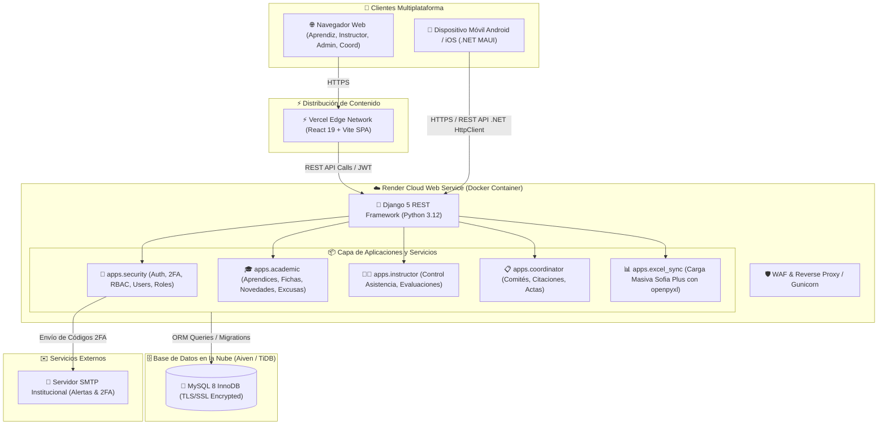

# 🏛️ Autogestión SENA — Sistema Integral de Novedades y Gestión Académica

- **Tipo:** Plataforma Web & Móvil Institucional (Fullstack Empresarial)
- **Estado:** 🟢 En Preparación para Producción (Render Container + Vercel Edge + Cloud MySQL)
- **Ubicación en disco:** `c:\Users\NITRO ACER\Desktop\proyectos con ia\autogestion-sena\`
- **Repositorios GitHub:**
  - 🚀 **Backend Web API:** [July173/Back-end-web-API-autogestionSena](https://github.com/July173/Back-end-web-API-autogestionSena) (Django REST Framework, MySQL, JWT, 2FA)
  - 🖥️ **Frontend Web:** [July173/autogestionFrontWeb](https://github.com/July173/autogestionFrontWeb) (React 19, TypeScript, Vite, TailwindCSS)
  - 📱 **Frontend Móvil:** [July173/FrontMovilAutogestion](https://github.com/July173/FrontMovilAutogestion) (.NET MAUI C# Multiplataforma)
- **Ramas del Proyecto:** `dev` (Desarrollo), `qa` (Staging/Validación), `main` (Producción)
- **Stack Tecnológico:** Python 3.12, Django 5.x, Django REST Framework, SimpleJWT, MySQL 8, Docker, React 19, Vite, TailwindCSS, .NET MAUI C# 12, Render Cloud, Vercel Edge
- **Relacionado:** [[00_Centro_de_Mando]], [[Clean Code y SOLID]], [[Arquitectura Limpia y Patrones de Arquitectura]], [[Blindaje Anti-Bots y Proteccion de Recursos]], [[DevOps y CI-CD (GitHub Actions, Azure, Jenkins y Despliegues)]], [[Diseno Responsivo y Adaptabilidad (Web, Mobile y TV)]]

---

## 🎯 Descripción del Proyecto
**Autogestión SENA** es una solución integral multiplataforma diseñada para transformar y digitalizar los procesos académicos, disciplinarios y administrativos del Servicio Nacional de Aprendizaje (SENA). Centraliza el registro y seguimiento de novedades de aprendices, control de asistencia en tiempo real, citación a comités de evaluación y sincronización masiva de datos institucionales desde hojas de cálculo Excel generadas en Sofia Plus.

---

## 🏗️ Arquitectura del Sistema

---

## 👥 Módulos Principales y Capacidades

### 1. 🔐 Seguridad, Roles y Autenticación de Dos Factores (2FA)
- Autenticación institucional restringida a dominios `@sena.edu.co` y `@soy.sena.edu.co`.
- Segundo factor de autenticación obligatorio (código numérico de 6 dígitos con expiración de 5 minutos enviado vía correo electrónico).
- **Modo Demostración Integrado:** Bypass seguro con código universal `123456` para pruebas públicas y revisiones de portafolio.
- Control de acceso basado en roles (RBAC) dinámico por formulario y vista:
  - `1`: Administrador (Acceso absoluto a usuarios, roles, módulos y permisos).
  - `2`: Aprendiz (Autogestión de novedades, excusas e historial).
  - `3`: Instructor (Gestión de aprendices, control de asistencia por sesión y fichas).
  - `4`: Coordinador (Supervisión académica, comités de evaluación y seguimiento).
  - `5`: Operador Sofia Plus (Carga masiva y sincronización documental).

### 2. 🎓 Módulo de Aprendices
- Radicación digital de novedades (traslados, aplazamientos, retiros voluntarios, cambios de jornada).
- Carga de soportes documentales y excusas médicas/laborales con trazabilidad de estado (Pendiente, En Revisión, Aprobada, Rechazada).
- Consulta interactiva del historial disciplinario y asistencias.

### 3. 👨‍🏫 Módulo de Instructores
- Visualización detallada de fichas de caracterización asignadas.
- Registro ágil de asistencia diaria y faltas justificadas/injustificadas.
- Envío automático de alertas a coordinación ante ausentismos reiterados.

### 4. 📋 Módulo de Coordinación
- Panel de control para análisis de novedades radicadas por ficha y programa formativo.
- Citación automática a comités de evaluación y seguimiento con generación de actas.

### 5. 📊 Carga Masiva y Sincronización Sofia Plus
- Procesamiento en streaming de archivos Excel (`.xlsx`) mediante `openpyxl`.
- Validación sintáctica y semántica de tipos de documento, números de identificación, nombres y fichas antes de persistir en base de datos.
- Generación de reportes de error fila por fila para corrección rápida.

### 6. 📱 Aplicación Móvil (.NET MAUI)
- Experiencia nativa optimizada en Android y Windows.
- Consumo centralizado de endpoints vía servicio desacoplado `Endpoints.cs`.
- Módulo de consulta rápida de novedades y notificaciones en tiempo real para aprendices e instructores en campo.

---

## 🛡️ Blindaje de Seguridad y Protección de Recursos (GEMINI.md Regla 8)

1. **Trampa Honeypot Invisible en Login:**
   - Campo oculto fuera del viewport (`institution_website_security`) en el formulario de inicio de sesión. Si es completado por un bot o scraper automático, el envío es abortado de inmediato.
2. **Defensa perimetral y Rate Limiting:**
   - Rate limiting contextual en endpoints de autenticación y mutaciones para prevenir ataques de fuerza bruta y saturación del servidor SMTP.
3. **Manejo Resiliente de Fallos SMTP:**
   - Si el servidor de correos no responde o se agotan las cuotas, el servicio de autenticación captura la excepción sin generar un error `500 Internal Server Error`, permitiendo el flujo de fallback.

---

## 🚀 Cuentas Demo para Evaluadores y Reclutadores (1 Clic)

El sistema cuenta con un selector visual en el login para iniciar sesión inmediatamente con cualquiera de los 5 roles utilizando la contraseña unificada **`Sena2026*`** y código 2FA **`123456`**:

| Rol | Correo Institucional Demo | Contraseña | Código 2FA Demo |
| :--- | :--- | :---: | :---: |
| 👑 **Administrador** | `admin.demo@sena.edu.co` | `Sena2026*` | `123456` |
| 🎓 **Aprendiz** | `aprendiz.demo@soy.sena.edu.co` | `Sena2026*` | `123456` |
| 👨‍🏫 **Instructor** | `instructor.demo@sena.edu.co` | `Sena2026*` | `123456` |
| 📋 **Coordinador** | `coordinador.demo@sena.edu.co` | `Sena2026*` | `123456` |
| 🖥️ **Operador Sofia** | `sofia.demo@sena.edu.co` | `Sena2026*` | `123456` |

---

## ⚙️ Despliegue en la Nube e Infraestructura

* **Backend:** Contenedor Docker en **Render Cloud** con blueprint `render.yaml`, `gunicorn`, auto-reinicio, y comando de arranque con verificación de base de datos (`entrypoint.sh`).
* **Base de Datos:** Instancia MySQL 8 en la nube (**Aiven Cloud / TiDB Serverless**) con soporte SSL/TLS y comando automático `seed_demo_users`.
* **Frontend:** Desplegado en **Vercel Edge Network** con rewrites SPA (`vercel.json`) y optimización de assets con Vite.
