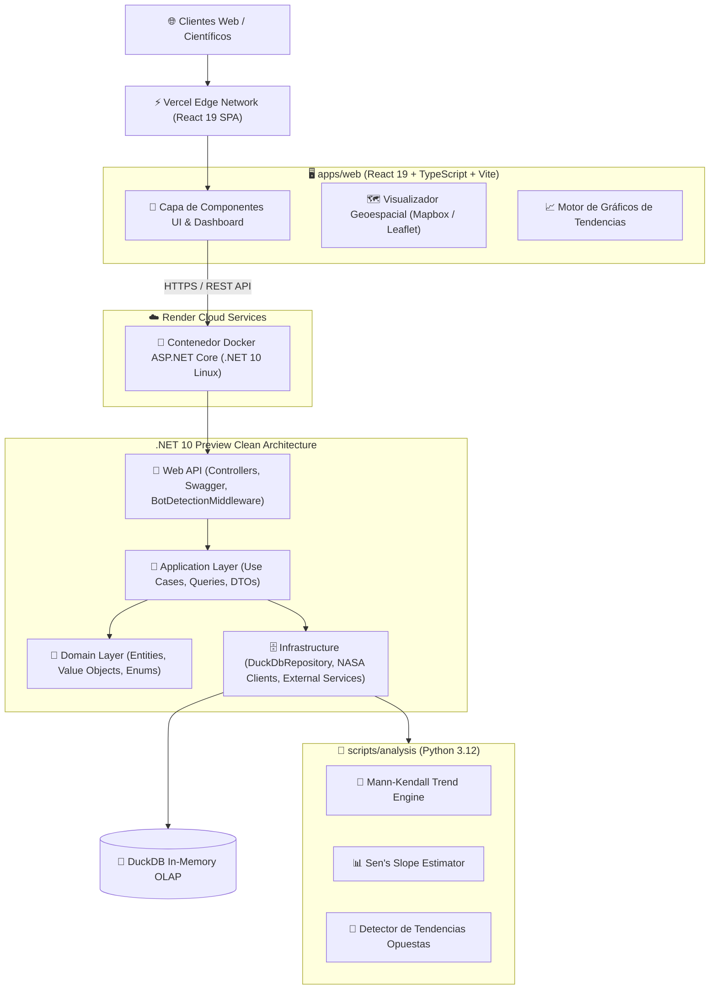

# 🌍 NASA Earth System Trend Detective

- **Tipo:** Plataforma Científica y Web Fullstack (NASA Space Apps Challenge 2026)
- **Estado:** 🟢 En Producción (Vercel Edge + Render Cloud Container)
- **Frontend Oficial:** [nasa-earth-trend-detective.vercel.app](https://nasa-earth-trend-detective.vercel.app/)
- **Backend Health Check:** [nasa-trend-detective-api.onrender.com/health](https://nasa-trend-detective-api.onrender.com/health)
- **Ubicación en disco:** `c:\Users\NITRO ACER\Desktop\proyectos con ia\nasa project\`
- **Repositorio GitHub:** [github.com/nasa-earth-detectives/nasa-earth-system-trend-detective](https://github.com/nasa-earth-detectives/nasa-earth-system-trend-detective)
- **Organización GitHub:** `@nasa-trend-detective` (Equipos: `@nasa-trend-detective/backend-team`, `@nasa-trend-detective/frontend-team`)
- **Ramas:** `development`, `qa`, `production` (Blindadas con GitHub Rulesets v2 Anti-Force Push)
- **Stack Tecnológico:** React 19, TypeScript, Vite, TailwindCSS, ASP.NET Core 10 Preview (Clean Architecture), Python 3.12 (SciPy / NumPy), DuckDB, Docker multi-stage, Vercel Edge, Render Cloud
- **Relacionado:** [[00_Centro_de_Mando]], [[00-Map-Of-Content]], [[Clean Code y SOLID]], [[Arquitectura Limpia y Patrones de Arquitectura]], [[Blindaje Anti-Bots y Proteccion de Recursos]], [[DevOps y CI-CD (GitHub Actions, Azure, Jenkins y Despliegues)]]

---

## 🎯 Descripción del Proyecto
Plataforma interactiva de exploración y análisis geoespacial para la detección de tendencias biofísicas opuestas e inesperadas en los sistemas terrestres de la NASA (NASA International Space Apps Challenge 2026). Integra datos satelitales multiespectrales con algoritmos estadísticos no paramétricos (**Mann-Kendall Test** y **Sen's Slope Estimator**) para correlacionar anomalías térmicas (GISTEMP v4), pérdida de masa de hielo (GRACE-FO), estrés de vegetación (MODIS NDVI) y emisiones de carbono (OCO-2).

---

## 👥 Equipo de Ingeniería (5 Participantes)

* **July:** Lead Backend Engineer & Data Scientist (Arquitectura .NET 10, DuckDB, algoritmos estadísticos).
* **Fabriany Medina (Reving):** Backend & Cloud Infrastructure Engineer (Docker, CI/CD, pipelines de ingesta ETL).
* **Johan Sebastian Olaya:** Lead Frontend Engineer (React 19, Vite, mapas geoespaciales interactivos).
* **Diego Arias:** Frontend & UI/UX Specialist (Visualización científica de datos, accesibilidad, gráficos D3/Chart.js).
* **Brayan Stid Cortés Lombana (`bscl`):** Solutions Architect, Security & DevSecOps Lead (Gobernanza, blindaje anti-bots, Vercel/Render, CI/CD, sincronización ClickUp).

---

## 🏗️ Arquitectura del Monorrepo



---

## 🛡️ Blindaje de Seguridad y Anti-Bots Activo

1. **`BotDetectionMiddleware` Perimetral:**
   - Inspección obligatoria de la cabecera `User-Agent` en todas las peticiones de mutación (`POST`, `PUT`, `DELETE`).
   - Bloqueo instantáneo con `HTTP 403 Forbidden` ante firmas de escáneres automáticos y herramientas de pentest (`sqlmap`, `nikto`, `masscan`, `wpscan`, `nmap`, `curl-custom-bots`).
2. **Trampas Honeypot Invisibles:**
   - Campos trampa camuflados fuera del viewport en formularios públicos de consulta y descarga de datos.
   - Si un scraper o bot llena el campo trampa, la petición se aborta con `400 Bad Request` antes de consumir recursos de cómputo en DuckDB.
3. **Control de Tasa Contextual (Rate Limiting):**
   - Rate limiting por IP diferenciado: navegación moderada, consultas analíticas pesadas protegidas contra denegación de servicio (DoS algorítmico).
4. **GitHub Rulesets v2 (Anti-Force Push):**
   - Reglas activas en GitHub para `production`, `qa` y `development` bloqueando `git push --force` y eliminación accidental de ramas maestras.

---

## 📋 Gestión y Trazabilidad en ClickUp (Sprint 1)

* **Espacio:** `NASA Space Apps 2026` | **Lista:** `Sprint 1: Datos, ETL y Arquitectura Base`
* **Tarea Principal:** [**[S1-T0] Despliegue en la Nube (Vercel & Render), Blindaje de Ramas y Gobernanza de Equipos**](https://app.clickup.com/t/86e3bbaxc) (`Complete` ✅)
  * `[S1-T0.1]` Despliegue de Frontend en Vercel Edge con SPA Routing y proxy API (`86e3bbazf`)
  * `[S1-T0.2]` Despliegue de Backend .NET 10 en Render Cloud con Blueprint `render.yaml` (`86e3bbazg`)
  * `[S1-T0.3]` Blindaje de ramas con GitHub Rulesets v2 Anti-Force Push (`86e3bbazj`)
  * `[S1-T0.4]` Creación de equipos en GitHub, CODEOWNERS y TEAM.md (`86e3bbazk`)
  * `[S1-T0.5]` Panel de acceso rápido para desarrolladores en README y GitHub Environments (`86e3bbazn`)

---

## 📚 Módulos de Documentación Detallada (Bóveda Interna)

Accede a la especificación exhaustiva del proyecto en:
* 🗺️ [[00-Map-Of-Content]] — Mapa Central de Contenidos del Proyecto
* 🏛️ [[01-Arquitectura-Monorrepo]] — Clean Architecture, capas y dependencias
* 🌿 [[02-Estrategia-Git-3-Ramas]] — Flujo `development` ➔ `qa` ➔ `production`
* 👥 [[03-Roles-y-Equipo]] — Perfiles, habilidades y asignación de los 5 participantes
* 📅 [[04-Sprints-y-Roadmap]] — Desglose de los 4 Sprints, 20 tareas y 55 subtareas
* 🔬 [[05-Rigor-Cientifico-MannKendall]] — Métodos estadísticos y datasets NASA
* 🚀 [[06-Pipeline-CI-CD]] — GitHub Actions, validación de tipos y compuertas de calidad
* 🧼 [[07-Estandares-Ingenieria]] — Estándares Clean Code, Anti-God Class y Cero Hardcoding
* 🐳 [[08-Contenedores-Docker]] — Docker multi-stage y Docker Compose
* 🛡️ [[09-Gobernanza-GitHub-Org-y-Projects]] — Equipos GitHub, CODEOWNERS y reglas de ramas
* ☁️ [[10-Despliegue-Cloud-Vercel-Render]] — Despliegues en Vercel Edge y Render Cloud
* 📋 [[11-Trazabilidad-ClickUp-Sprint-1]] — Registro completo de tareas y subtareas en ClickUp

---

## ⚙️ Comandos Rápidos de Trabajo

```bash
# Iniciar frontend en local (React 19 + Vite)
cd "apps/web"
npm run dev

# Iniciar backend en local (.NET 10 Preview)
cd "backend/src/NasaTrendDetective.Api"
dotnet run

# Ejecutar el contenedor unificado con Docker Compose
docker compose up -d --build

# Correr los tests de integración y análisis científico
dotnet test
python -m pytest scripts/analysis/
```
