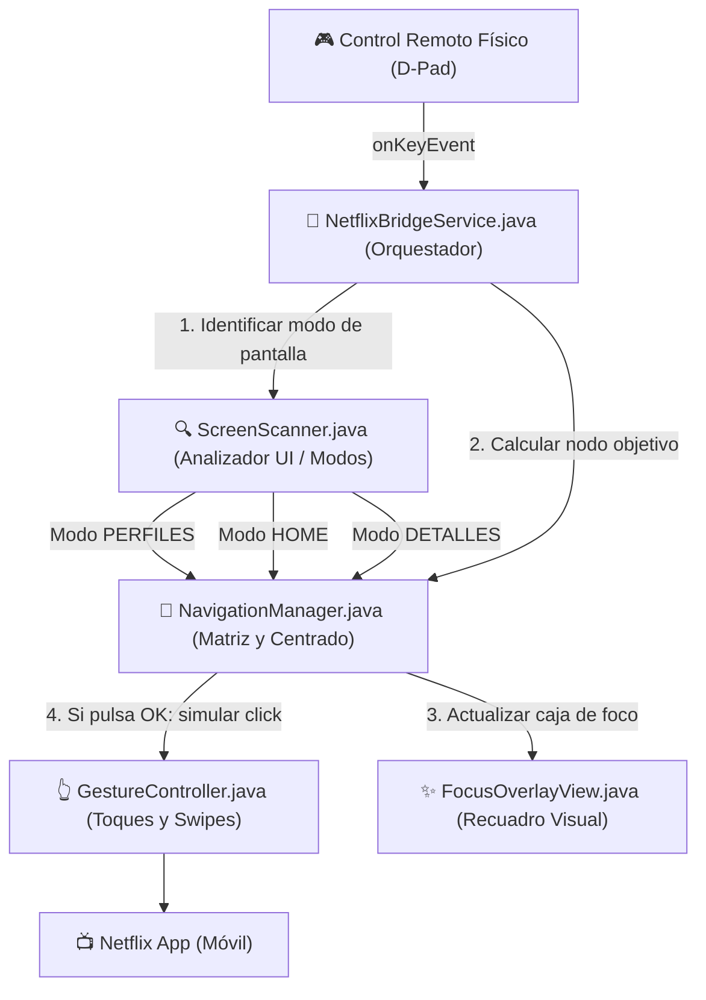

# 🎬 Netflix TV Bridge

- **Tipo:** Aplicación Android Nativa (Accessibility Service)
- **Estado:** 🟢 Activo
- **Ubicación en disco:** `c:\Users\NITRO ACER\Desktop\proyectos con ia\app de netflix modo tv\`
- **Relacionado:** [[Android Accessibility Service]], [[00_Centro_de_Mando]]

---

## 🎯 Objetivo
Transformar la aplicación táctil de Netflix (`com.netflix.mediaclient`) en una TV Box Android genérica (como la HQ90MX) en una experiencia idéntica a **Android TV**, controlable al 100% mediante el **control remoto físico (D-Pad)** y sin necesidad de emular ratón/cursor.

---

## 🏗️ Arquitectura de Componentes



---

## 📁 Archivos Clave del Proyecto
1. `NetflixBridgeService.java`: Servicio de accesibilidad principal, captura teclas físicas y eventos de ventana.
2. `NavigationManager.java`: Administra el árbol de nodos accesibles, foco tabular y auto-centrado vertical de filas.
3. `ScreenScanner.java`: Identifica en qué pantalla estamos (Perfiles, Home, Ficha de detalles, PIN).
4. `FocusOverlayView.java`: Dibuja el marco luminoso animado sobre el elemento enfocado.
5. `GestureController.java`: Emula gestos táctiles mediante `dispatchGesture`.
6. `build.ps1`: Script automatizado para compilar, alinear, firmar y desplegar el APK al dispositivo mediante ADB.

---

## ⚙️ Comandos Rápidos de Compilación
Para compilar e instalar directamente en la TV Box:
```powershell
.\build.ps1
```

---

## 📝 Notas y Tareas Pendientes
- [x] Eliminar dependencia de mouse virtual.
- [x] Auto-centrado de carruseles horizontales.
- [x] Detección de pantalla de perfiles y selección con OK.
- [ ] Pruebas en pantallas con scroll vertical profundo.
- [ ] Pulido fino de velocidad en animaciones de foco.
