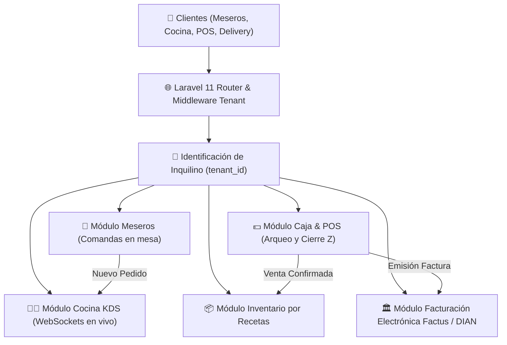

# 🍗 Restaurante Big Pollo — SaaS Multi-Tenant

- **Tipo:** Plataforma SaaS para Restaurantes (POS + KDS + Inventario + Facturación Electrónica DIAN)
- **Estado:** 🟢 Completado & Validado al 100% (18 tests automatizados en verde)
- **Ubicación en disco:** `c:\Users\NITRO ACER\Desktop\proyectos con ia\restaurante bigpollo\`
- **Repositorio GitHub:** [github.com/brayancortes22/restaurante-bigpollo](https://github.com/brayancortes22/restaurante-bigpollo)
- **Ramas:** `development`, `qa`, `main` (Totalmente sincronizadas)
- **Stack Tecnológico:** Laravel 11, PHP 8.3, Action Classes, DTOs, API Factus (DIAN), Ley 1581 (Habeas Data), UI/UX Dark Slate & Glassmorphism
- **Relacionado:** [[00_Centro_de_Mando]], [[Seguridad de Datos, Habeas Data y Privacidad Legal]], [[Diseno Web UI UX Profesional]]

---

## 🏗️ Arquitectura del Sistema Multi-Tenant



---

## 🎯 Módulos Core a Construir

1. **🏢 Multi-Tenant SaaS:**
   * Soporte para múltiples restaurantes en la misma plataforma con aislamiento seguro por `tenant_id`.
2. **📱 Toma de Pedidos para Meseros (Mobile-First):**
   * Vista táctil para celulares/tablets con mapa de mesas, estados (Libre, Ocupada, Por pagar) y modificadores de platos.
3. **🧑‍🍳 KDS Cocina en Tiempo Real:**
   * Visualización instantánea de comandas por orden de llegada con semáforo de tiempo (Verde, Amarillo, Rojo) y alertas sonoras.
4. **💵 Caja (POS) & Cierres de Turno:**
   * Apertura de turno con base en efectivo, métodos de pago múltiples (Efectivo, Tarjeta, Transferencia), cancelaciones auditadas y reporte de Cierre Z.
5. **📦 Inventario Inteligente por Receta:**
   * Descuento automático de ingredientes (ej. Vender 1 "Pollo Broaster" descuenta 1 unidad de pollo y 200g de harina).
   * Alertas de stock crítico en el Dashboard.
6. **🏛️ Facturación Electrónica DIAN (API Factus):**
   * Emisión asíncrona mediante Jobs en Laravel, recepción de CUFE, código QR y envío automático de factura por email.

---

## ⚙️ Comandos Rápidos de Trabajo

```bash
# Levantar el servidor local de desarrollo
php artisan serve

# Ejecutar las pruebas automáticas
php artisan test

# Ejecutar migraciones de base de datos
php artisan migrate

# Crear un nuevo modelo, migración y controlador
php artisan make:model Mesa -mcr
```
