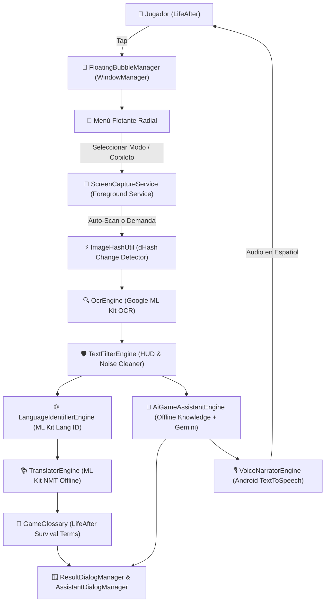

# 🎮 Traductor de Juegos & Copiloto IA (Android)

- **Tipo:** Aplicación Android Nativa (Burbuja Flotante + OCR + ML Kit Offline + Copiloto IA + Voz en Vivo)
- **Estado:** 🟢 En desarrollo activo y optimizado
- **Ubicación en disco:** `c:\Users\NITRO ACER\Desktop\proyectos con ia\traductor de juegos\`
- **Repositorio GitHub:** [github.com/brayancortes22/traductor-de-juegos](https://github.com/brayancortes22/traductor-de-juegos)
- **Ramas:** `development`, `qa`, `main` (Estrategia de 3 ramas estrictas)
- **Relacionado:** [[00_Centro_de_Mando]], [[Android Accessibility Service]], [[Catalogo de Skills (Antigravity)]]

---

## 🎯 Objetivo
Permitir a los jugadores de videojuegos móviles en Android (especialmente en títulos masivos y de supervivencia como **LifeAfter**) traducir textos en pantalla y recibir **asistencia táctica en tiempo real por voz e interfaz flotante** sin salir del juego, sin consumir datos móviles, sin anuncios y con garantía del 100% contra baneos al utilizar captura externa de pantalla mediante la API oficial de Android (`MediaProjection`).

---

## 🚀 Funcionalidades Pro & Pro+ (Superando Apps Comerciales como Bubble Translate)

1. 🌐 **100% Gratis y Libre de Anuncios:** Cero publicidad invasiva o suscripciones recurrentes.
2. ⚡ **Auto-Scan en Tiempo Real:** Bucle adaptativo cada 1.5s con **Perceptual Hashing (dHash)**. Traduce solo si el texto cambió (0% CPU en pantallas estáticas).
3. 🔍 **Detección Automática de Idioma On-Device:** Usando `com.google.mlkit:language-id`, detecta instantáneamente si el texto es inglés, chino, japonés o portugués sin configuración manual.
4. 🛡️ **Filtro Inteligente de Elementos Irrelevantes (Anti-Ruido HUD):** Descarte algorítmico mediante Regex de barras de salud (`250/250`), munición (`18/220`), ping de red (`108ms`), coordenadas y números aislados. Solo traduce misiones, descripciones y diálogos.
5. 💎 **Traducción con IA Max y Glosario LifeAfter:** Motor neural local refinado con diccionario de supervivencia (*Portable Formula* ➔ *Fórmula Portátil*, *Amino Acid* ➔ *Aminoácido*, *Material Bench* ➔ *Banco de Materiales*, etc.).
6. 🧠 **Copiloto Estratégico IA de Juego ("¿Qué debo hacer?"):** Analiza la misión o receta en pantalla y explica:
   - 🎯 Objetivo claro en español.
   - 📍 Dónde conseguir los recursos necesarios (mapas, enemigos o tiendas).
   - 🛠️ Paso a paso exacto para fabricarlo o completarlo.
   - ⚡ Consejos pro de supervivencia.
   - *Modo híbrido:* Base de conocimiento local offline + consulta en la nube a Gemini Flash / Smart Router opcional.
7. 🎙️ **Copiloto de Voz en Vivo (Narrador TextToSpeech):** Te habla por los altavoces o auriculares de la tablet explicándote la misión sin que tengas que quitar los dedos de los controles para leer. Con audio ducking para no ensordecer el juego y control antispam/cooldown.

---

## 🕹️ Modos de Traducción Específicos (LifeAfter & Gaming)
A partir del análisis de las capturas de la Samsung Galaxy Tab A11 (`1340 x 800`):

1. 📸 **Pantalla Completa:** Captura todo el fotograma en 1 toque.
2. ✂️ **Recorte Libre (Parcial):** Arrastra el dedo para recortar una descripción de arma o carta.
3. 📜 **Modo Misiones (LifeAfter):** Enfocado automáticamente en el cuadrante superior izquierdo (`X: 0% - 42%`, `Y: 10% - 65%`).
4. 🏪 **Modo Tienda / Fórmulas:** Enfocado en el panel central modal (`X: 5% - 95%`, `Y: 8% - 92%`).
5. 💬 **Modo Diálogos / Chat:** Enfocado en la zona inferior (`X: 25% - 75%`, `Y: 75% - 98%`).
6. 🧠 **Modo Copiloto Asistente:** Invoca el análisis táctico de juego.

---

## 🏗️ Arquitectura de Componentes Modular (Anti God-Class)



---

## 🛡️ Trazabilidad de Fixes Críticos Aplicados
1. **Modal de sistema de 16 KB en One UI 6.1 / Android 15:**
   - *Causa:* El sistema advertía incompatibilidad con 16 KB en apps con depuración activa, desplegando un diálogo modal del sistema operativo que interceptaba todos los eventos táctiles, haciendo que la app pareciera no responder.
   - *Solución:* Se desactivó `isDebuggable` y se configuró empaquetado nativo JNI (`useLegacyPackaging = true`) en `build.gradle.kts`.
2. **SecurityException en Android 14 (`API 34`) MediaProjection:**
   - *Causa:* `MediaProjectionManager.getMediaProjection()` era llamado antes de activar el Foreground Service. En Android 14 esto lanza un fallo de seguridad inmediato.
   - *Solución:* Se invirtió el orden en `ScreenCaptureService.kt`, invocando `ServiceCompat.startForeground(..., FOREGROUND_SERVICE_TYPE_MEDIA_PROJECTION)` antes de `getMediaProjection()`.
3. **UX de Descarga Offline Incierta y Bloqueo Inicial:**
   - *Causa:* Diálogo estático que forzaba a esperar la descarga de 30 MB antes de usar la app.
   - *Solución:* Implementación de `isModelDownloaded` para confirmación instantánea sin redescargas innecesarias y layout con `ProgressBar` animada.
4. **Crash al Tocar la Burbuja Flotante (`UnsupportedOperationException`):**
   - *Causa:* `ScreenCaptureService` opera sobre un contexto de servicio (`Theme.DeviceDefault`) que carece del tema `Theme.GameTranslator`. Al inflar `view_floating_menu.xml` con atributos como `?attr/selectableItemBackgroundBorderless`, lanzaba `java.lang.UnsupportedOperationException: Failed to resolve attribute at index 13` provocando cierre forzado.
   - *Solución:* Se envolvieron los infladores con `ContextThemeWrapper(context, R.style.Theme_GameTranslator)`, se implementó el drawable seguro `bg_menu_item.xml` y se aislaron los layouts de overlay.
5. **Motor de Traducción Híbrida (Online Inmediato + Paquete Offline Opcional):**
   - *Causa:* Obligar a descargar el paquete offline antes de permitir cualquier traducción creaba fricción si la red fallaba.
   - *Solución:* Implementación de `OnlineTranslatorEngine` con fallback automático. Si el usuario no tiene descargado el modelo local, traduce instantáneamente en línea a alta velocidad. La descarga offline pasó a ser completamente opcional desde `MainActivity`.
6. **Sistema Global de Registro y Diagnóstico (`CrashLogger`):**
   - *Implementación:* Manejador global `UncaughtExceptionHandler` que guarda los stacktraces en `crash_report.log` y expone un visor en `MainActivity` ("📋 Ver Registro de Errores / Debug") con opciones de copia al portapapeles y limpieza rápida.
7. **Traducción Sobrepuesta Directa en Pantalla (In-Place Overlay):**
   - *Implementación:* Vista de superposición `InPlaceTranslationOverlayView` que renderiza las cajas de traducción al español exactamente sobre las coordenadas (`Rect`) del texto en inglés original, cubriéndolo con fondo oscuro y tipografía nítida con auto-ajuste de tamaño de fuente (`StaticLayout`). Se descarta con un simple tap en cualquier parte de la pantalla.
8. **Copiloto Táctico IA & Parser Quirúrgico de Misiones:**
   - *Causa:* Falsos positivos de keywords como `"gathering list"` causaban que siempre respondiera lo del manual de supervivencia, ignorando la misión activa en curso.
   - *Solución:* Módulo `GameMissionParser` que aísla el HUD de misiones superior izquierdo (`x < 42%`, `y: 10% - 60%`), traduce el objetivo al español y genera consejos dinámicos según el tipo de acción (*Follow / Acompañar, Talk / Hablar, Defeat / Eliminar, Gather / Recolectar, Craft / Fabricar*) y locución en vivo.
9. **Copiloto Táctico Integral & Base de Habilidades de Supervivencia:**
   - *Funcionalidad:* El copiloto ya no se limita a misiones: ahora responde con precisión quirúrgica qué es, para qué sirve, cómo se obtiene/mejora y si vale la pena subir de nivel las habilidades de **Fuerza / Combate** (Light/Heavy Firearms, Physical Fitness, Combat Recovery), **Creación / Crafteo** (Field Crafting, Building Enhancement, Gear Crafting) y **Recolección** (Logging, Mining, Hemp).
   - *Desglose Visual Dinámico:* Diálogo táctico (`AssistantDialogManager` y `view_assistant_dialog.xml`) con tarjetas temáticas: *¿Qué debo hacer / Qué es?*, *¿A dónde ir / Dónde se ubica?*, *¿Qué buscar y llevar / Costo en puntos?*, *Paso a paso 1, 2, 3* y *Consejo Pro / Prioridad*.
10. **Modo Diálogo Dinámico Pasante & Algoritmo Anti-Colisión de Cajas:**
   - *Click-Through Activo (`FLAG_NOT_TOUCHABLE`):* Al activar el modo Diálogo (`LIFEAFTER_CHAT`), la superposición de traducción no intercepta los toques, permitiendo al jugador tocar cualquier parte de la pantalla para pasar diálogos en LifeAfter sin que el visor se cierre.
   - *Rastreo Reactivo (`dHash`):* `ScreenCaptureService` supervisa la franja de diálogo cada 750 ms; cuando detecta cambio de línea por toque del usuario, refresca la traducción en pantalla en tiempo real sin recargar la vista.
   - *Algoritmo Anti-Colisión:* `InPlaceTranslationOverlayView` fusiona bloques de texto verticalmente adyacentes o superpuestos en pastillas cinematográficas oscuras unificadas (`#EE090D16` con borde sutil), evitando que las cajas se pisen, crucen o generen artefactos visuales.

11. **Purga de Bloatware y Evolución a HUD Minimalista de Alta Velocidad:**
    - *Diagnóstico:* La inclusión de sintetizadores de voz (TTS), análisis heurístico por LLMs y recortes estáticos de misiones/tienda generaba sobrecarga visual, lentitud y respuestas inexactas para el flujo dinámico de LifeAfter.
    - *Solución:* Purga completa del módulo de voz (`VoiceNarratorEngine`), del copiloto IA (`AiGameAssistantEngine`, `AssistantDialogManager`) y de modos redundantes. El menú flotante se transformó en un HUD compacto con solo 5 opciones: *Pantalla Completa*, *Recorte Libre*, *Auto-Diálogo [Toggle]*, *Tiempo Real [Toggle]*, *Filtrar HUD [Toggle]* y botón directo *🛑 Detener Servicio*.
12. **Apagado Inmediato desde el Menú Flotante (`btn_stop_service`):**
    - *Implementación:* Botón dedicado en rojo que invoca `stopServiceCompletely()`, desmontando de inmediato las vistas del `WindowManager` (`bubbleManager.hide()`, `currentInPlaceOverlay?.detach()`) y finalizando el `Foreground Service` con `stopSelf()` sin requerir que el usuario pause o salga del videojuego a la actividad principal.
13. **Falla Crítica de Descarga de Modelos y Solución de Ciclo de Vida:**
    - *Falla Identificada:* La descarga del modelo offline de ML Kit (~30 MB) se ejecutaba dentro del `lifecycleScope` de `MainActivity`. Cuando el jugador abría el juego, el sistema operativo ponía `MainActivity` en segundo plano (`onStop`), cancelando automáticamente la corrutina de descarga antes de finalizar. Por esta razón, el modelo offline nunca terminaba de instalarse.
    - *Solución:* Se delegó la descarga y verificación de fondo a `ScreenCaptureService` utilizando `serviceScope`. Al ser un `Foreground Service` con notificación de sistema persistente, el proceso permanece inmune a recolecciones de ciclo de vida mientras el jugador disfruta de su partida.
14. **Resolución de Latencia en Traducción (Caché `isOfflineReady` & Inferencia Local):**
    - *Falla Identificada:* Al no completarse el paquete offline y evaluar `isModelDownloaded` bloque por bloque mediante `Task` de Google Play Services, el sistema caía repetidamente en fallback online realizando múltiples llamadas HTTP externas por fotograma, introduciendo latencias de 1 a 3 segundos.
    - *Solución:* Se implementó la bandera `@Volatile isOfflineReady: Boolean` en `TranslatorEngine`. Una vez verificado o descargado el modelo, la traducción neural se ejecuta on-device sobre la CPU de la tablet en solo 15 a 30 milisegundos.
15. **Aceleración de Frecuencia de Muestreo:**
    - Se redujo el retardo del observador de subtítulos automáticos a 450 ms (captura reactiva instantánea al hablar NPCs).
    - Se redujo el retardo del escaneo continuo en tiempo real a 650 ms.
16. **Reglas Operativas de CI/CD y ADB en PowerShell:**
    - *Binary Pipe Corruption:* Nunca capturar artefactos de GitHub Actions redirigiendo streams en PowerShell (`gh api ... > file.zip`) debido a que PowerShell inserta codificación UTF-16LE corrompiendo el archivo binario. Usar obligatoriamente `curl.exe -L -H "Authorization: Bearer $token" "URL" -o file.zip`.
    - *Keystore Incompatible:* Dado que los runners de GitHub Actions generan llaves de firma de depuración (`debug.keystore`) efímeras en cada ejecución, `adb install -r` falla con `INSTALL_FAILED_UPDATE_INCOMPATIBLE`. Siempre ejecutar `adb uninstall com.bscl.gametranslator.debug` antes de la instalación limpia.

---

## 📱 Despliegue Inalámbrico en Samsung Galaxy Tab
```powershell
# Conectar por ADB Wi-Fi a la tablet
& "C:\Users\NITRO ACER\Desktop\proyectos con ia\app de netflix modo tv\platform-tools\adb.exe" connect 192.168.100.15:45577

# Desinstalar versión previa e instalar nueva
& "C:\Users\NITRO ACER\Desktop\proyectos con ia\app de netflix modo tv\platform-tools\adb.exe" uninstall com.bscl.gametranslator.debug
& "C:\Users\NITRO ACER\Desktop\proyectos con ia\app de netflix modo tv\platform-tools\adb.exe" install -r app-debug.apk

# Lanzar MainActivity
& "C:\Users\NITRO ACER\Desktop\proyectos con ia\app de netflix modo tv\platform-tools\adb.exe" shell am start -n com.bscl.gametranslator.debug/com.bscl.gametranslator.ui.MainActivity
```

