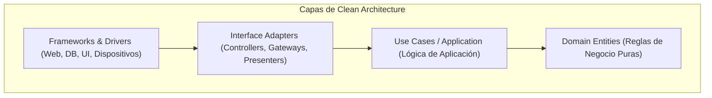

# 🏛️ Arquitectura Limpia & Patrones de Arquitectura

- **Área:** Diseño de Sistemas de Alto Nivel
- **Relacionado:** [[Clean Code y SOLID]], [[Patrones de Diseno (GoF)]], [[Archify (Diagramas de Arquitectura)]]

---

## 🎯 Clean Architecture (Uncle Bob)

La regla de oro de la **Arquitectura Limpia**: *Las dependencias siempre deben apuntar hacia adentro (hacia el núcleo del negocio).*

### Principios Fundamentales:
1. **Independencia de Frameworks:** El negocio no debe depender de si usas Laravel, Express, Spring o Next.js. El framework es solo un detalle de entrega.
2. **Independencia de la Base de Datos:** Puedes cambiar de PostgreSQL a MongoDB sin tocar las reglas de negocio.
3. **Testeable al 100%:** Los casos de uso se pueden probar sin levantar un servidor web ni conectar una base de datos real.

---

## 🔌 Arquitectura Hexagonal (Puertos y Adaptadores)

* **El Núcleo (Core):** Contiene la lógica pura de la aplicación y define **Puertos** (Interfaces).
  * *Puerto de Entrada:* Casos de uso a los que la UI o API llama.
  * *Puerto de Salida:* Interfaces para persistencia (Repositorios), envío de emails o APIs de terceros.
* **Adaptadores:**
  * *Adaptador Primario (Driving):* Controlador REST, CLI, cola de mensajes.
  * *Adaptador Secundario (Driven):* Implementación de repositorio en SQL, cliente HTTP de Stripe, logger en disco.

---

## 🧠 Domain-Driven Design (DDD) — Conceptos Esenciales

* **Entidades:** Objetos con identidad única que persiste en el tiempo (ej. `Usuario` con ID).
* **Value Objects (Objetos de Valor):** Inmutables y definidos únicamente por su valor (ej. `Dinero`, `EmailAddress`, `CoordenadaGPS`).
* **Agregados (Aggregates):** Conjunto de entidades y value objects tratados como una unidad atómica (ej. `Pedido` con sus `LineasDePedido`). El *Aggregate Root* protege las invariantes.
* **Repositorios:** Abstracciones para guardar y recuperar agregados como si estuvieran en memoria.
* **Eventos de Dominio:** Algo importante que ocurrió en el negocio (`PedidoPagado`, `UsuarioRegistrado`).

---

## 🚀 Patrones Modernos de Arquitectura

1. **CQRS (Command Query Responsibility Segregation):**
   * Separa las operaciones de **Escritura (Comandos)** de las operaciones de **Lectura (Consultas)**.
   * Permite optimizar bases de datos de lectura independientes y desnormalizadas para consultas instantáneas.
2. **Event-Driven Architecture (Dirigida por Eventos):**
   * Desacopla servicios mediante colas o brokers (Kafka, RabbitMQ, Redis Pub/Sub). Los servicios reaccionan a eventos sin conocer quién los emitió.
3. **Monolito Modular vs Microservicios:**
   * Empieza siempre con un **Monolito Modular** bien diseñado con límites claros entre módulos. Migra a microservicios solo cuando la escala del equipo o del tráfico lo justifique estrictamente.
