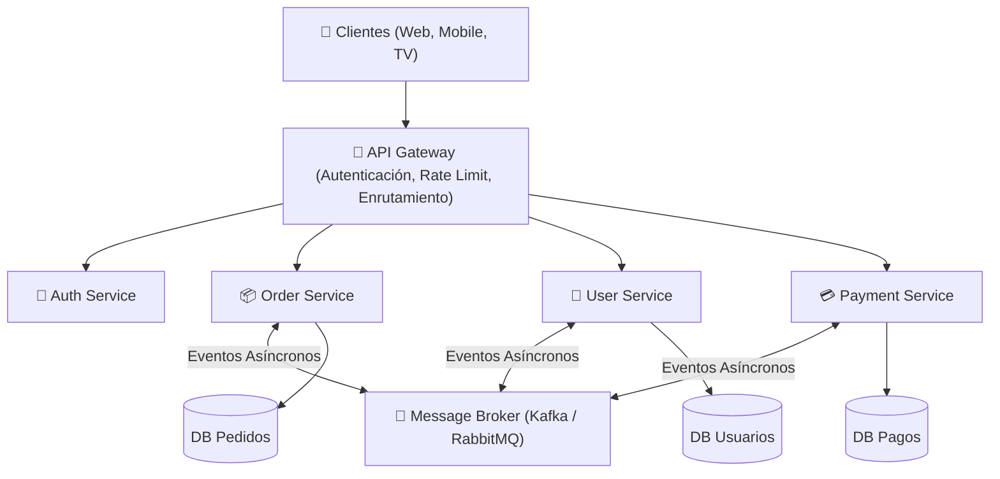

# 🌐 Arquitectura de Microservicios

- **Área:** Sistemas Distribuidos / Backend Escalable / Cloud Native
- **Relacionado:** [[Arquitectura Limpia y Patrones de Arquitectura]], [[Diseno y Optimizacion de Bases de Datos]], [[Archify (Diagramas de Arquitectura)]]

---

## 🏛️ Anatomía de un Ecosistema de Microservicios

---

## 🔑 Principio Fundamental: Base de Datos por Servicio (Database-per-Service)
* Cada microservicio debe ser **dueño absoluto de su propia base de datos**.
* 🛑 **Antipatrón Prohibido:** Que dos microservicios hagan consultas directamente a la misma base de datos (rompe el encapsulamiento e impide desplegarlos independientemente).
* Si el servicio de Pedidos necesita el nombre del usuario, o bien lo consulta por API (`gRPC`), o mantiene una proyección local actualizada mediante **eventos**.

---

## 🧩 Patrones Esenciales en Microservicios

### 1. API Gateway
* Punto único de entrada para todos los clientes.
* Centraliza: balanceo de carga, terminación SSL, autenticación (validación de JWT), métricas y limitación de peticiones (*Rate Limiting*).

### 2. Patrón Saga (Transacciones Distribuidas)
En microservicios no existe `BEGIN TRANSACTION` que cubra múltiples bases de datos. La Saga coordina transacciones locales:
* **Coreografía (Descentralizada):** Cada servicio publica un evento (`OrdenCreada`) y el siguiente reacciona (`ProcesarPago`). Si falla, se emite un evento compensatorio (`CancelarOrden`).
* **Orquestación (Centralizada):** Un servicio orquestador envía comandos explícitos a cada participante y gestiona los retrocesos si algo falla.

### 3. Circuit Breaker (Cortocircuito)
* Evita que la caída de un servicio secundario bloquee en cascada a todo el sistema.
* Estados:
  - 🟢 **Closed (Cerrado):** El tráfico fluye normalmente.
  - 🔴 **Open (Abierto):** Si los errores superan un umbral (ej. 50%), las peticiones rebotan al instante sin esperar timeout, devolviendo una respuesta de respaldo (*fallback*).
  - 🟡 **Half-Open (Semiabierto):** Deja pasar algunas peticiones de prueba para ver si el servicio se recuperó.

### 4. Outbox Pattern (Garantía de Entrega de Eventos)
* Guarda en la misma transacción SQL local los datos del negocio y el evento a emitir en una tabla `outbox`.
* Un worker lee la tabla `outbox` y lo publica al Broker (Kafka/RabbitMQ), garantizando que nunca se pierdan eventos si el broker cae momentáneamente.

---

## 📡 Protocolos de Comunicación

| Protocolo | Tipo | Ideal para |
| :--- | :--- | :--- |
| **REST (JSON / HTTP)** | Síncrono | Comunicación externa hacia clientes web y móviles. |
| **gRPC (Protocol Buffers)** | Síncrono de alto rendimiento | Comunicación interna entre microservicios (binario, tipado estricto, multiplexado HTTP/2). |
| **Kafka / RabbitMQ** | Asíncrono (Event-Driven) | Notificaciones masivas, procesamiento diferido y desacoplamiento temporal. |

---

## 🔍 Observabilidad Distribuida (Los 3 Pilares)

1. **Logs Centralizados:** Recolectar logs de todos los contenedores con correlación de identificadores (ELK Stack, Grafana Loki).
2. **Métricas en Tiempo Real:** Latencia, tasa de errores (4xx/5xx) y consumo de recursos con Prometheus + Grafana.
3. **Trazabilidad Distribuida (Distributed Tracing):** Un `TraceId` único que acompaña a la petición a través de todos los microservicios para identificar exactamente qué nodo provocó lentitud (OpenTelemetry, Jaeger).
