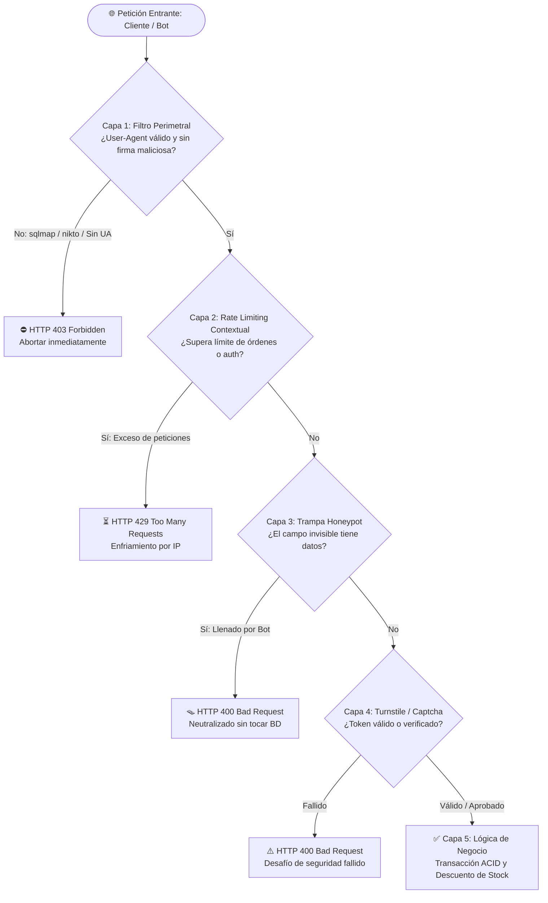

# 🛡️ Blindaje Integral Anti-Bots y Protección de Recursos

- **Categoría:** Ciberseguridad, Arquitectura Defensiva y Protección de API
- **Tags:** #seguridad #ciberseguridad #antibots #honeypot #ratelimiting #waf #owasp #rendimiento
- **Autor / Arquitecto:** Brayan Stid Cortés Lombana (`bscl`)
- **Relacionado:** [[00_Centro_de_Mando]], [[Perfil y Reglas de Trabajo (Brayan - bscl)]], [[Accesorios Lilis]], [[Seguridad_de_Datos_Habeas_Data_y_Privacidad_Legal]], [[DevOps y CI-CD (GitHub Actions, Azure, Jenkins y Despliegues)]]

---

## 🎯 Visión General

Todo sistema web comercial y API REST expuesta a Internet está bajo el constante asedio de **scrapers no autorizados, scripts automáticos y bots maliciosos**. Los mayores peligros a nivel de negocio son:

1. 📉 **Agotamiento de Inventario (*Denial of Inventory*):** Bots que generan órdenes falsas masivas para dejar en cero el stock real disponible, paralizando las ventas a clientes legítimos.
2. 🔨 **Ataques de Fuerza Bruta en Autenticación:** Diccionarios automatizados para adivinar contraseñas de administradores o clientes.
3. 🌪️ **Consumo Abusivo de Recursos (DDoS en Capa 7):** Peticiones repetitivas que saturan la base de datos o agotan la cuota de servicios en la nube.
4. 🕵️ **Escaneos Automatizados de Vulnerabilidades:** Herramientas de penetración como `sqlmap`, `nikto`, `masscan` o `wpscan` buscando inyecciones y fallos de configuración.

Para contrarrestar estas amenazas sin degradar la experiencia de los clientes humanos reales, se establece un **Modelo de Defensa Multicapa en Profundidad (Defense in Depth)**.

---

## 🏗️ Diagrama del Flujo de Defensa Multicapa



---

## 🛡️ Pilares de Implementación Técnica

### 1. 🪤 Trampas Honeypot Invisibles (Detección Silenciosa de Bots)

Los bots automatizados, rastreadores y herramientas de relleno automático leen el DOM HTML y completan todos los campos `<input>` que encuentran para maximizar el éxito del formulario.

#### Implementación en Frontend (React / HTML):
Se inserta un campo señuelo posicionado completamente fuera del viewport visible mediante CSS absoluto o dimensiones cero, con atributos de accesibilidad para no confundir a lectores de pantalla:

```tsx
<div
  style={{
    position: 'absolute',
    left: '-9999px',
    top: '-9999px',
    width: '1px',
    height: '1px',
    opacity: 0,
    pointerEvents: 'none',
  }}
  aria-hidden="true"
>
  <label htmlFor="hp_validation_key">Dejar este campo vacío</label>
  <input
    id="hp_validation_key"
    type="text"
    name="hp_validation_key"
    tabIndex={-1}
    autoComplete="off"
    value={trapField}
    onChange={(e) => setTrapField(e.target.value)}
  />
</div>
```

#### Validación en Backend (C# / Node / PHP):
Si el backend recibe **cualquier carácter** dentro de `TrapField`, aborta el procesamiento de forma instantánea:

```csharp
if (!string.IsNullOrWhiteSpace(request.TrapField))
{
    // Abortar de inmediato antes de abrir transacciones o consultar MySQL
    throw new BusinessException("Solicitud rechazada por actividad automatizada sospechosa.");
}
```

* **Ventaja:** 100% invisible para el comprador real; 100% efectivo contra scripts básicos y de nivel intermedio. Cero fricción (no requiere resolver semáforos ni imágenes).

---

### 2. ⏱️ Rate Limiting por IP Contextualizado

No todos los endpoints deben tener el mismo umbral de frecuencia. Una sola política global es insuficiente.

| Contexto de Endpoint | Límite Típico | Ventana de Tiempo | Propósito Técnico |
| :--- | :---: | :---: | :--- |
| **Navegación General (GET / Catálogo)** | 300 req | 1 minuto | Permitir navegación fluida y carga de imágenes. |
| **Autenticación (Login / Registro / Pass)** | 30 req | 1 minuto | Frenar ataques de fuerza bruta y ataques de diccionario. |
| **Creación de Pedidos / Checkout / Reservas** | 5 a 10 req | 10 minutos | **Prevenir agotamiento de stock e inventario (*Denial of Inventory*).** |

#### Ejemplo en ASP.NET Core (`Program.cs`):
```csharp
options.AddPolicy("OrdersLimit", httpContext =>
{
    if (httpContext.Request.Method == "OPTIONS")
    {
        return RateLimitPartition.GetNoLimiter("preflight");
    }
    var clientIp = httpContext.Connection.RemoteIpAddress?.ToString() ?? "unknown";
    return RateLimitPartition.GetFixedWindowLimiter(clientIp, _ => new FixedWindowRateLimiterOptions
    {
        PermitLimit = 10,
        Window = TimeSpan.FromMinutes(10),
        QueueProcessingOrder = QueueProcessingOrder.OldestFirst,
        QueueLimit = 0
    });
});
```

---

### 3. 🛡️ Filtrado Perimetral de Cabeceras (`BotDetectionMiddleware`)

Filtra peticiones en la capa de transporte HTTP antes de que lleguen a los controladores o consuman memoria en deserialización JSON compleja.

* **Requisito obligatorio:** Las operaciones de mutación (`POST`, `PUT`, `PATCH`, `DELETE`) exigen cabecera `User-Agent` presente y con longitud mínima.
* **Firmas bloqueadas:** Detección de herramientas de escaneo maliciosas:
  - `sqlmap` (Inyección SQL automatizada)
  - `nikto` (Escáner de vulnerabilidades de servidor web)
  - `masscan` / `nmap` (Escaneo masivo de puertos y servicios)
  - `wpscan` (Escáner de CMS y plugins)
  - `acunetix`, `dirbuster`, `gobuster`, `havij`

---

### 4. 🧩 Cloudflare Turnstile / reCAPTCHA v3

* **Cloudflare Turnstile:** Alternativa inteligente y privada a reCAPTCHA. Utiliza pruebas de trabajo invisibles (*Proof of Work*) en el navegador sin molestar al usuario con acertijos visuales.
* **Integración desacoplada:** El backend cuenta con `ICaptchaService` configurable mediante variables de entorno (`CAPTCHA_SECRET_KEY` y `CAPTCHA_VERIFY_URL`). Si la clave está ausente (como en desarrollo local), el servicio cuenta con un bypass seguro para no entorpecer pruebas offline.

---

### 5. 📧 Filtro de Correos Desechables (*Disposable Emails*)

Los bots crean cuentas automatizadas usando servicios de bandejas de entrada temporales de 10 minutos. Se mantiene una lista negra de dominios en backend (`mailinator.com`, `tempmail.com`, `yopmail.com`, `10minutemail.com`, `guerrillamail.com`) para rechazar registros con correos efímeros antes de guardar el registro.

---

## 🧪 Estrategia de Pruebas Automatizadas

Cada proyecto debe contar con pruebas unitarias y de integración dedicadas para garantizar la efectividad de las defensas anti-bot:

```text
==========================================================
      TEST: PROTECCIÓN INTEGRAL CONTRA BOTS Y SCRAPERS    
==========================================================
  [Paso 1] Probando trampa invisible Honeypot en pedidos...
    -> EXITOSO: El bot cayó en la trampa Honeypot y fue neutralizado.
  [Paso 2] Probando bloqueo de petición sin User-Agent...
    -> EXITOSO: Petición sin User-Agent bloqueada con HTTP 403.
  [Paso 3] Probando bloqueo por firma de sqlmap...
    -> EXITOSO: Herramienta automatizada bloqueada con HTTP 403.
  [Paso 4] Probando bloqueo por escáner Nikto...
    -> EXITOSO: Escáner Nikto bloqueado con HTTP 403.
  [Paso 5] Verificando solicitud legítima de cliente humano...
    -> EXITOSO: Los clientes humanos con solicitudes limpias procesan normalmente.
```

---

## 📌 Casos de Éxito en Proyectos
* **[[Accesorios Lilis]]:** Implementado y desplegado a producción en Vercel y backend .NET 10 con Honeypot en checkout, `OrdersLimit` (10 pedidos / 10 min) y `BotDetectionMiddleware`.
* **[[Restaurante Bigpollo]]:** Modelo obligatorio para reservas de mesa y pedidos online para prevenir ocupación de mesas fantasma.
