# 🧠 Catálogo de Skills (Habilidades de Antigravity)

- **Propósito:** Registro completo de las habilidades especializadas (*Skills*) que tu asistente de IA tiene disponibles para resolver tareas complejas.
- **Relacionado:** [[00_Centro_de_Mando]], [[Colaboracion con IA (Antigravity)]]

---

## 🗺️ Mapa de Habilidades por Categoría

```mermaid
graph TD
    Skills["🧠 Habilidades de Antigravity"]
    
    Skills --> Arch["📐 Arquitectura y Diagramas"]
    Skills --> AI["🤖 Inteligencia Artificial Gemini"]
    Skills --> Web["🌐 Desarrollo Web & Extensiones"]
    Skills --> Cloud["☁️ Ecosistema Firebase"]
    Skills --> Eng["🏛️ Ingeniería de Software & Buenas Prácticas"]
    Skills --> Core["⚙️ Sistema y Personalización"]

    Arch --> Archify["[[Archify (Diagramas de Arquitectura)]]"]
    AI --> GeminiEco["[[Gemini AI Ecosystem]]"]
    AI --> Neural["[[Redes Neuronales y Deep Learning]]"]
    AI --> MultiAgent["[[Sistemas Multiagente (Arquitectura, Orquestacion y Patrones)]]"]
    Web --> WebExt["[[Modern Web & Chrome Extensions]]"]
    Web --> DesignEng["[[Frontend_Design_Engineering_UI_Skills]]"]
    Web --> UIUX["[[Diseno_Web_UI_UX_Profesional]]"]
    Cloud --> FireEco["[[Firebase Suite]]"]
    Eng --> CleanCode["[[Clean Code y SOLID]]"]
    Eng --> Patterns["[[Patrones de Diseno (GoF)]]"]
    Eng --> CleanArch["[[Arquitectura Limpia y Patrones de Arquitectura]]"]
    Eng --> Micro["[[Arquitectura de Microservicios]]"]
    Eng --> Testing["[[Testing y Calidad de Software]]"]
    Eng --> CICD["[[DevOps y CI-CD (GitHub Actions, Azure, Jenkins y Despliegues)]]"]
    Eng --> Frameworks["[[Desarrollo Limpio con Frameworks (React, Angular, Laravel)]]"]
    Eng --> Resp["[[Diseno Responsivo y Adaptabilidad (Web, Mobile y TV)]]"]
    Eng --> DB["[[Diseno y Optimizacion de Bases de Datos]]"]
    Core --> AgyCustom["[[Agy Customizations & Extension]]"]
```

---

## 📋 Lista Rápida de Habilidades

### 1. 📐 Arquitectura y Diagramación
* **[[Archify (Diagramas de Arquitectura)]]**: Generación de diagramas de arquitectura, flujos de datos y secuencias en HTML interactivo standalone, con exportación a PNG/SVG/WebM y soporte Mermaid.

### 2. 🤖 Modelos de Inteligencia Artificial (Gemini & Gemma)
* **[[Gemini AI Ecosystem]]**:
  * `gemini-api-dev`: Implementación de modelos Gemini y Gemma multimodal (texto, imagen, audio, video) y structured outputs.
  * `gemini-interactions-api`: Agentes, chat multi-turn y tareas asíncronas.
  * `gemini-live-api-dev`: Streaming en tiempo real con WebSockets, VAD (Voice Activity Detection) y voz bidireccional de baja latencia.
  * `gemini-omni-flash-api`: Edición y generación de video con IA mediante Gemini Omni Flash.
* **[[Redes Neuronales y Deep Learning]]**: Fundamentos matemáticos, Perceptrón, Backpropagation, Redes Convolucionales (CNN) y Arquitectura de Transformers.
* **[[Sistemas Multiagente (Arquitectura, Orquestacion y Patrones)]]**: Orquestación jerárquica (Supervisor/Workers), bucle Actor-Critic, LangGraph, CrewAI y buenas prácticas de prevención de bucles.

### 3. 🌐 Frontend Moderno, Design Engineering & Extensiones
* **[[Frontend_Design_Engineering_UI_Skills]]** ⭐:
  * `design-engineering`: Estándares de clase mundial de **UI Skills** (Julien Thibeaut / Addy Osmani / Emil Kowalski). Domina Baseline UI, micro-espaciado, animación 60 FPS acelerada por GPU, Core Web Vitals, accesibilidad WCAG 2.2 AA, CSS moderno (Container Queries, `:has`, `oklch`) y auditoría con React Doctor.
* **[[Diseno_Web_UI_UX_Profesional]]**:
  * `ui-ux-designer`: Experiencia WOW, paletas armónicas, modo oscuro premium, tipografía tabular y glassmorphism.
* **[[Modern Web & Chrome Extensions]]**:
  * `modern-web-guidance`: Estándares modernos de CSS/HTML/JS, animaciones dirigidas por scroll, glassmorphism, selector `:has()` y Web APIs avanzadas.
  * `chrome-extensions`: Creación y publicación de extensiones para Google Chrome con Manifest V3.

### 4. ☁️ Backend & Nube con Firebase
* **[[Firebase Suite]]**:
  * `firebase-firestore`: Bases de datos NoSQL en tiempo real, modelado y consultas eficientes.
  * `firebase-auth-basics`: Autenticación de usuarios, login social y permisos.
  * `firebase-data-connect`: PostgreSQL relacional con GraphQL en Firebase.
  * `firebase-ai-logic-basics`: Conexión de Gemini con el backend de Firebase.
  * `firebase-hosting-basics` y `firebase-app-hosting-basics`: Despliegue en la nube.
  * `firebase-crashlytics` y `firebase-remote-config-basics`: Telemetría y feature flags.
  * `firebase-security-rules-auditor`: Auditoría de seguridad de reglas de base de datos.

### 5. 🏛️ Ingeniería de Software & Buenas Prácticas
* **[[Clean Code y SOLID]]**: Reglas de oro de código limpio (DRY, KISS, YAGNI, Boy Scout) y los 5 principios SOLID.
* **[[Patrones de Diseno (GoF)]]**: Patrones Creacionales, Estructurales y de Comportamiento con casos de uso prácticos.
* **[[Arquitectura Limpia y Patrones de Arquitectura]]**: Clean Architecture, Hexagonal (Ports & Adapters), DDD y CQRS.
* **[[Arquitectura de Microservicios]]**: Database-per-Service, Saga Pattern, Circuit Breaker, Outbox y observabilidad distribuida.
* **[[Testing y Calidad de Software]]**: Pirámide de testing, TDD (Red-Green-Refactor) y dobles de prueba (Mocks/Stubs).
* **[[DevOps y CI-CD (GitHub Actions, Azure, Jenkins y Despliegues)]]**: Pipelines automatizados, integración continua, Blue-Green, Canary y validación de redirecciones.
* **[[Desarrollo Limpio con Frameworks (React, Angular, Laravel)]]**: Patrones limpios para React (Hooks/Inmutabilidad), Angular (Standalone/Signals) y Laravel (Actions/Form Requests).
* **[[Diseno Responsivo y Adaptabilidad (Web, Mobile y TV)]]**: Mobile-First, tipografía fluida con clamp(), Container Queries y UI de TV.
* **[[Diseno y Optimizacion de Bases de Datos]]**: Normalización (1NF a 3NF), optimización de índices B-Tree/Covering, erradicación de N+1 y arquitecturas Read-Replica + Redis.

### 6. ⚙️ Núcleo, Referencias y Customizaciones
* **[[Documentacion Universal de Lenguajes]]**: Especificaciones oficiales, estándares modernos y cheat sheets de cualquier lenguaje (Java, Python, TS, PHP, Go, Rust, SQL).
* **[[Seguridad de Datos, Habeas Data y Privacidad Legal]]**:
  * `data-security-privacy`: Cumplimiento de Habeas Data (Ley 1581 Colombia / SIC), GDPR, consentimiento explícito, encriptación en reposo y tránsito, audit logs y blindaje legal anti-demandas.
* **[[Diseno Web UI UX Profesional]]**:
  * `ui-ux-designer`: Diseño de interfaces web y móviles de nivel élite, factor WOW, micro-animaciones, glassmorphism, tipografía fluida y ergonomía POS/KDS.
* **[[Agy Customizations & Extension]]**:
  * `antigravity-guide`: Manual de comandos de terminal `agy`, atajos de teclado y workflows de IDE.
  * `agy-customizations`: Cómo crear nuevos *Skills*, reglas personalizadas (`GEMINI.md`) o plugins para entrenarme en tus propios proyectos.

---

> 💡 **Cómo activar una Skill:** No necesitas configurarlas manualmente; cuando me pidas una tarea relevante (por ejemplo: *"Crea un diagrama de arquitectura interactivo para Netflix TV Bridge"* o *"Configura una extensión de Chrome"*), detecto la habilidad correspondiente y la aplico automáticamente con sus mejores prácticas.
