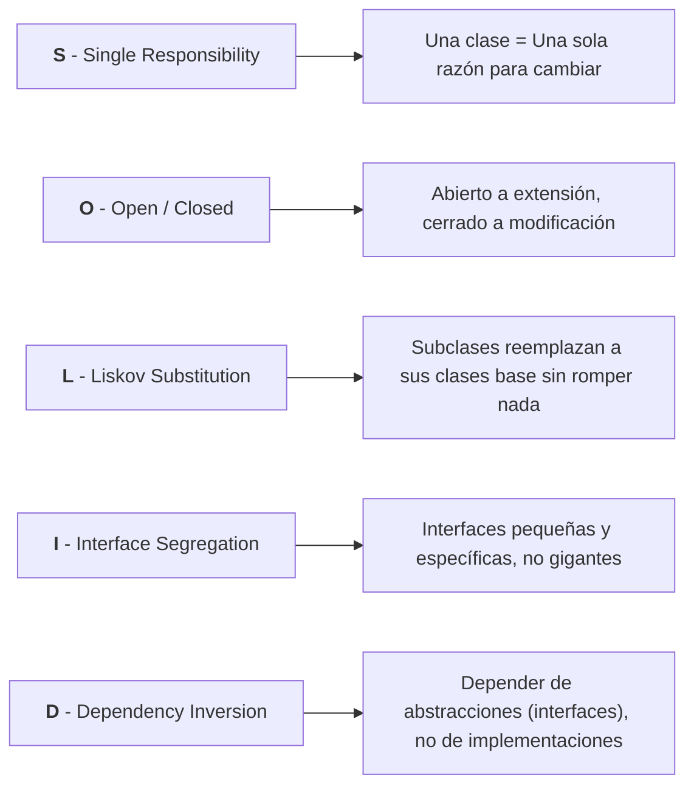

# 🧼 Clean Code & Principios SOLID

- **Área:** Calidad de Código / Buenas Prácticas
- **Relacionado:** [[Catalogo de Skills (Antigravity)]], [[Patrones de Diseno (GoF)]], [[Arquitectura Limpia y Patrones de Arquitectura]]

---

## 🏛️ Los 5 Principios SOLID

### 1. SRP — Single Responsibility Principle (Responsabilidad Única)
* Cada módulo, clase o función debe hacer **una sola cosa y hacerla bien**.
* **Señal de alarma (Code Smell):** Clases "God Object" que validan datos, hacen consultas SQL y envían correos todo junto.
* **Solución:** Extraer clases dedicadas (`UserValidator`, `UserRepository`, `EmailService`).

### 2. OCP — Open/Closed Principle (Abierto/Cerrado)
* Las entidades deben estar **abiertas a extensión pero cerradas a modificación**.
* En lugar de llenar el código con `if/switch` cada vez que agregas un método de pago o un tipo de usuario, usa **polimorfismo** e interfaces.

### 3. LSP — Liskov Substitution Principle (Sustitución de Liskov)
* Si la clase `B` hereda de `A`, deberías poder pasar una instancia de `B` en cualquier lugar donde se espere `A` sin que el programa falle.
* Ejemplo clásico de violación: La clase `Cuadrado` heredando de `Rectangulo` (modificar el ancho de un cuadrado altera su alto de forma inesperada).

### 4. ISP — Interface Segregation Principle (Segregación de Interfaces)
* Ningún cliente debería verse obligado a depender de métodos que no utiliza.
* Es mucho mejor tener 3 interfaces pequeñas (`CanFly`, `CanSwim`, `CanWalk`) que una interfaz monolítica gigante (`Animal`) con métodos vacíos o que lanzan excepciones.

### 5. DIP — Dependency Inversion Principle (Inversión de Dependencias)
* Los módulos de alto nivel no deben depender de los de bajo nivel; ambos deben depender de abstracciones.
* **Ejemplo práctico:** Tu servicio de compras no debe instanciar directamente `new MySQLConnection()`, sino recibir una interfaz `DatabaseInterface` inyectada en su constructor.

---

## 💎 Reglas de Oro de Clean Code

1. **Nombres Expresivos:**
   - Evita variables como `x`, `temp`, `data`.
   - Usa nombres que revelen la intención: `activeUsersList`, `calculateTotalPriceWithTax()`.
2. **Funciones Pequeñas y Enfocadas:**
   - Una función ideal no debería superar las 20 líneas y debe tener un solo nivel de abstracción.
3. **Principio DRY (Don't Repeat Yourself):**
   - Si copias y pegas lógica más de dos veces, abstrae una función o servicio reutilizable.
4. **Principio KISS (Keep It Simple, Stupid):**
   - La solución más sencilla y legible siempre supera a una solución innecesariamente compleja o sobre-diseñada.
5. **Principio YAGNI (You Aren't Gonna Need It):**
   - No implementes funciones "por si acaso las necesitamos en el futuro". Construye lo que necesitas hoy con buena arquitectura para extenderlo mañana.
6. **Regla del Boy Scout:**
   - Deja siempre el archivo de código un poco más limpio de como lo encontraste al entrar.
