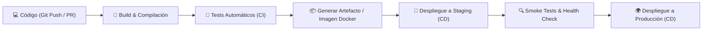
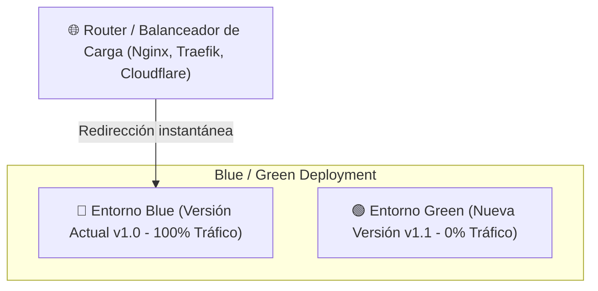

# 🚀 DevOps, CI/CD & Estrategias de Despliegue y Redirección

- **Área:** Automatización de Software / DevOps / Infraestructura y Despliegue
- **Relacionado:** [[Testing y Calidad de Software]], [[Arquitectura de Microservicios]], [[00_Centro_de_Mando]]

---

## 🔄 ¿Qué es CI/CD? (Integración y Despliegue Continuo)



| Sigla | Nombre | Qué hace |
| :--- | :--- | :--- |
| **CI** | **Continuous Integration** (Integración Continua) | Cada vez que un desarrollador sube código (`git push`), un servidor compila el proyecto, corre linters de código y ejecuta toda la batería de pruebas automáticas. Si un test falla, **bloquea el Pull Request**. |
| **CD** | **Continuous Delivery** (Entrega Continua) | Automatiza la creación del empaquetado (APK, imagen Docker, binario) listo para ser desplegado en cualquier momento a producción con la aprobación de 1 clic. |
| **CD** | **Continuous Deployment** (Despliegue Continuo) | Todo cambio que pasa exitosamente las pruebas en la rama principal se despliega **directa y automáticamente a producción** sin intervención humana manual. |

---

## 🌿 Flujo Estándar de 3 Ramas (Development -> QA -> Production)

El estándar de desarrollo para nuestros repositorios sigue la arquitectura de 3 niveles de aislamiento:

| Rama | Propósito | Despliegue Automático asociado |
| :--- | :--- | :--- |
| `development` | Trabajo activo, commits diarios y unión de *feature branches*. | Entorno de desarrollo local / Dev Server |
| `qa` | Pruebas integrales, validación de QA y pruebas de humo (Smoke tests). | Entorno de **Staging** |
| `production` | Versión oficial y estable visible para usuarios finales. | Entorno de **Producción** (Zero-Downtime) |

* **Regla estricta:** Ningún cambio llega a `production` sin haber sido mezclado y probado previamente en `development` y superado las pruebas de `qa`.

---

## 🛠️ Comparativa de Herramientas Populares

### 1. 🐙 GitHub Actions
* **Ubicación:** Se define en archivos `.github/workflows/pipeline.yml` dentro del mismo repositorio.
* **Ventajas:** Integración nativa con GitHub, catálogo masivo de acciones comunitarias en el Marketplace, runners gratuitos en Linux/Windows/macOS.
* **Ejemplo de Pipeline:**
```yaml
name: CI/CD Pipeline
on:
  push:
    branches: [ main ]
jobs:
  build-and-test:
    runs-on: ubuntu-latest
    steps:
      - uses: actions/checkout@v4
      - name: Setup Node
        uses: actions/setup-node@v4
        with: { node-version: 20 }
      - run: npm ci
      - run: npm test
      - name: Deploy to Cloud
        if: success()
        run: ./deploy.sh
```

### 2. 🔷 Azure DevOps (Azure Pipelines)
* **Ubicación:** Archivos `azure-pipelines.yml`.
* **Ventajas:** Ideal para entornos empresariales de Microsoft, perfecta integración con Azure Cloud (App Services, AKS, Container Apps), gestión avanzada de tableros ágiles (Azure Boards) y repositorios privados.

### 3. 🎩 Jenkins
* **Ubicación:** Archivos `Jenkinsfile` (Pipelines declarativos o scripted).
* **Ventajas:** Código abierto y auto-hospedado (*Self-hosted*). Control total de la infraestructura en servidores propios (On-Premise), cientos de plugins personalizables.

---

## 🔀 Estrategias de Despliegue y Redirección de Tráfico

Para actualizar sistemas en producción **sin tiempo de inactividad (Zero Downtime)** ni caídas de servicio:



### 1. Blue-Green Deployment (Redirección Instantánea)
* Se mantienen dos entornos idénticos: **Blue** (producción activa) y **Green** (inactivo).
* Despliegas la nueva versión en **Green** y corres pruebas internas sin que los usuarios la vean.
* Si todo está perfecto, el Balanceador de Carga o DNS **redirige el 100% del tráfico** hacia Green en 1 segundo.
* **Rollback inmediato:** Si aparece un error crítico, vuelves a redirigir el tráfico a Blue al instante.

### 2. Canary Releases (Despliegue Canario)
* Se redirige solo un pequeño porcentaje de usuarios (ej. el **5% del tráfico**) a la nueva versión.
* El sistema monitorea métricas de errores (4xx/5xx) y consumo de memoria.
* Si todo está estable, se redirige el 25%, luego el 50% y finalmente el 100%.

### 3. Rolling Updates (Actualización Progresiva)
* En clústeres de Kubernetes o contenedores Docker, se actualiza un pod o servidor a la vez, garantizando que siempre haya instancias activas atendiendo peticiones.

---

## 🚦 Pruebas de Redireccionamiento y Salud (Smoke Tests)

Durante el pipeline de despliegue, es obligatorio verificar que las redirecciones y endpoints respondan correctamente:

1. **Pruebas de Códigos de Estado HTTP:**
   - `301 Moved Permanently`: Redirección permanente (vital para SEO ante cambio de URLs).
   - `302 / 307 Found`: Redirección temporal (ej. mantenimiento o flujo de login).
   - `308 Permanent Redirect`: Redirección permanente que preserva el método HTTP (POST/PUT).
2. **Redirección Forzada a HTTPS:**
   - Asegurar que cualquier petición a `http://midominio.com` redirija automáticamente con `301` a `https://midominio.com`.
3. **Health Checks y Smoke Tests:**
   - El pipeline hace una petición de prueba al endpoint `/healthz` o `/status` del nuevo entorno:
   ```bash
   # Debe responder HTTP 200 con { "status": "healthy" }
   curl -f https://staging.midominio.com/healthz || exit 1
   ```
   - Si el endpoint falla o redirige a una página de error 500, el despliegue se cancela automáticamente antes de afectar a los usuarios reales.
