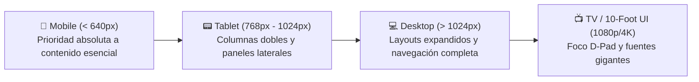

# 📱 Diseño Responsivo & Adaptabilidad (Web, Mobile y TV)

- **Área:** Diseño de Interfaces (UI/UX) / Frontend Moderno
- **Relacionado:** [[Modern Web & Chrome Extensions]], [[Desarrollo Limpio con Frameworks (React, Angular, Laravel)]], [[Netflix TV Bridge]], [[Accesorios Lilis]]

---

## 🎯 Filosofía Mobile-First

El enfoque **Mobile-First** consiste en diseñar y codificar primero para la pantalla más pequeña y con mayores restricciones, y luego expandir la interfaz progresivamente hacia pantallas más grandes con `@media (min-width: ...)`.



### Ventajas de Mobile-First:
1. **Código CSS más limpio:** El CSS base es minimalista; evitas sobreescribir estilos de escritorio con parches de `max-width`.
2. **Rendimiento superior (Core Web Vitals):** Menos carga de recursos pesados innecesarios en redes móviles.
3. **Claridad de producto:** Te obliga a priorizar lo que realmente importa al usuario antes de rellenar espacios vacíos.

---

## 📐 Tipografía y Espaciado Fluido (Sin saturar Media Queries)

La función `clamp()` en CSS moderno permite que textos, márgenes y paddings se adapten suavemente al ancho de la pantalla sin saltos bruscos:

```css
/* Sintaxis: clamp(mínimo, valor_preferido_fluido, máximo) */
h1 {
  font-size: clamp(1.75rem, 4vw + 1rem, 3.5rem);
}

.container {
  padding: clamp(1rem, 3vw, 2.5rem);
}
```

### Solución a las barras móviles con Unidades Dinámicas:
En celulares, las barras del navegador cambian de tamaño al hacer scroll. Usa unidades modernas en vez de `100vh`:
* `100dvh` (Dynamic Viewport Height): Se adapta en tiempo real según si la barra de URL está visible u oculta.
* `100svh` (Small Viewport Height): Altura fija asumiendo que la barra está visible.
* `100lvh` (Large Viewport Height): Altura completa asumiendo que la barra está oculta.

---

## 🧱 Layouts Automáticos con CSS Grid y Flexbox

### El Santo Grial de las tarjetas responsivas (Cero Media Queries):
```css
.card-grid {
  display: grid;
  grid-template-columns: repeat(auto-fit, minmax(280px, 1fr));
  gap: 1.5rem;
}
```
* Las tarjetas se acomodan solas: 1 columna en móvil, 2 en tablet, 3 o 4 en escritorio, sin escribir una sola `@media query`.

---

## 📦 Container Queries (`@container`): La Nueva Frontera

Antes, los componentes solo podían consultar el tamaño de la ventana completa (`@media (min-width: ...)`). Ahora, con **Container Queries**, un componente se adapta al tamaño del contenedor padre donde se incruste (ej. un sidebar estrecho vs el contenido central):

```css
.card-container {
  container-type: inline-size;
}

@container (min-width: 450px) {
  .product-card {
    display: flex; /* Pasa de tarjeta vertical a horizontal si el padre tiene espacio */
  }
}
```

---

## 👆 Ergonomía Táctil en Mobile vs Ratón

* **Touch Targets (Zonas Táctiles Seguras):**
  - Cualquier botón o enlace debe tener un área táctil mínima de **48 x 48 píxeles** (estándar WCAG / Google Material).
* **Zona del Pulgar (Thumb Zone):**
  - En móviles, las acciones principales (barra de navegación, botón de compra, carrito) deben ubicarse en la **parte inferior de la pantalla**, donde el pulgar llega sin esfuerzo.
* **Manejo de Hover Seguro:**
  - Las pantallas táctiles no tienen puntero. Nunca escondas información vital detrás de un `:hover`:
  ```css
  /* Aplicar hover solo en dispositivos con ratón real */
  @media (hover: hover) and (pointer: fine) {
    .btn:hover {
      background-color: #2563eb;
      transform: translateY(-2px);
    }
  }
  ```

---

## 📺 Adaptabilidad a Pantallas de TV (Experiencia 10-Foot UI)

Como aprendimos en el proyecto **[[Netflix TV Bridge]]**, diseñar para un televisor requiere consideraciones únicas:
1. **Distancia de visión:** El usuario está a 2 o 3 metros de distancia. Los textos deben ser grandes y legibles.
2. **Navegación por Foco (D-Pad):** No existe el cursor ni el toque directo. Siempre debe haber un elemento visualmente destacado con borde brillante o escala (`transform: scale(1.08)`).
3. **Safe Zones:** Dejar un margen de seguridad del 5% en los bordes de la pantalla para evitar cortes por overscan en televisores antiguos.

---

## 🖼️ Imágenes y Multimedia Responsiva

* **Etiqueta `<picture>`:** Servir imágenes optimizadas según la resolución y el ancho:
```html
<picture>
  <source media="(min-width: 1024px)" srcset="banner-desktop.webp">
  <source media="(min-width: 640px)" srcset="banner-tablet.webp">
  
</picture>
```
* **Prevención de CLS (Cumulative Layout Shift):**
  - Siempre especifica `width`, `height` o la propiedad CSS `aspect-ratio: 16 / 9` en imágenes y videos para que el navegador reserve el espacio antes de que descarguen, evitando que la página salte.
