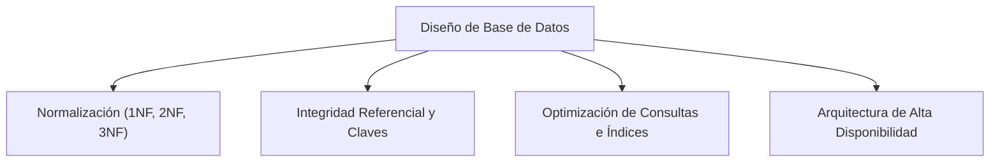

# 🗄️ Diseño & Optimización de Bases de Datos

- **Área:** Ingeniería de Datos / Rendimiento y Arquitectura Backend
- **Relacionado:** [[Arquitectura Limpia y Patrones de Arquitectura]], [[Desarrollo Limpio con Frameworks (React, Angular, Laravel)]]

---

## 📐 1. Diseño y Modelado Relacional



### Formas Normales (Normalización):
* **1NF (Primera Forma Normal):** Cada columna contiene valores atómicos e indivisibles (sin listas ni comas dentro de un campo) y cada fila tiene clave primaria única.
* **2NF (Segunda Forma Normal):** Cumple 1NF y ningún atributo no clave depende parcialmente de una clave compuesta.
* **3NF (Tercera Forma Normal):** Cumple 2NF y no existen dependencias transitivas (ninguna columna no clave depende de otra columna no clave).
* **¿Cuándo Desnormalizar?** En analítica (OLAP) o sistemas con alta carga de lectura donde los `JOIN` masivos penalizan el rendimiento; se almacena el dato redundante de forma controlada.

---

## ⚡ 2. Estrategias de Indexación y Optimización

* **Tipos de Índices:**
  - **B-Tree (Por defecto):** Ideal para búsquedas de igualdad (`=`), rangos (`BETWEEN`, `>`, `<`) y ordenamiento (`ORDER BY`).
  - **Índices Compuestos:** `(status, created_at)`. *Regla de oro:* El orden importa (Leftmost Prefix Rule). El filtro más selectivo va primero.
  - **Covering Index (Índice Cubridor):** Un índice que contiene todas las columnas que el `SELECT` necesita, permitiendo a la base de datos resolver la consulta leyendo solo la memoria del índice sin tocar la tabla en disco (Index-Only Scan).
* **Análisis de Consultas con `EXPLAIN ANALYZE`:**
  - 🛑 **Seq Scan / Full Table Scan:** La base de datos revisa millón por millón de filas. ¡Alerta roja en tablas grandes!
  - 🟢 **Index Scan / Index Only Scan:** Acceso directo en tiempo logarítmico `O(log N)`.

---

## 🚫 3. La Plaga del Problema N+1 (Y cómo erradicarlo)

* **El Problema:** Consultar 100 posts y luego hacer 1 query por cada post para traer a su autor. Resultado: 101 queries a la base de datos que saturan el servidor.
* **La Solución (Eager Loading):**
  - Traer todos los autores asociados en 1 sola consulta adicional: `SELECT * FROM users WHERE id IN (1, 2, ... 100)`.
  - En Laravel: `Post::with('author')->get()`.
  - En SQL puro: Un `LEFT JOIN` adecuado.

---

## 🏛️ 4. Arquitecturas de Alta Escala en Bases de Datos

```mermaid
graph LR
    App["Servidor de Aplicación"]
    App -->|Escrituras (INSERT/UPDATE/DELETE)| Primary["Master / Primary DB"]
    Primary -->|Replicación Asíncrona| Replica1["Read Replica 1"]
    Primary -->|Replicación Asíncrona| Replica2["Read Replica 2"]
    App -->|Lecturas (SELECT)| Replica1
    App -->|Lecturas (SELECT)| Replica2
    App <-->|Consultas Frecuentes| RedisCache["Caché Redis (En Memoria)"]
```

1. **Replicación Primario-Réplica (Read Replicas):**
   - El nodo Primario recibe todas las transacciones de escritura.
   - Varias réplicas de solo lectura atienden las consultas de los usuarios, distribuyendo la carga.
2. **Capa de Caché con Redis (Patrón Cache-Aside):**
   - La aplicación consulta primero a Redis (latencia < 1ms).
   - Si no está (Cache Miss), va a SQL, guarda en Redis con TTL (tiempo de vida) y entrega el resultado.
3. **Particionamiento y Sharding:**
   - **Particionamiento Horizontal:** Dividir una tabla gigante por fechas (ej. partición por año/mes).
   - **Sharding:** Dividir la base de datos física entre varios servidores según un identificador (ej. usuarios de región A en Servidor 1, región B en Servidor 2).
