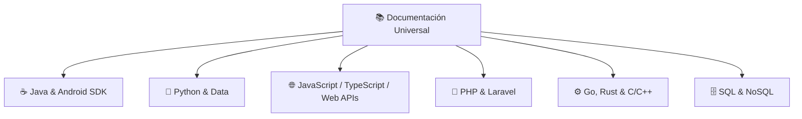

# 📚 Documentación Universal de Lenguajes & APIs

- **Área:** Referencia Técnica / Cheat Sheets / Documentación Oficial
- **Relacionado:** [[Catalogo de Skills (Antigravity)]], [[Clean Code y SOLID]], [[00_Centro_de_Mando]]

---

## 🧭 Referencias Oficiales & Canónicas por Ecosistema

---

### 1. ☕ Java & Android SDK
* **Java Standard Edition:** [Oracle Java Docs](https://docs.oracle.com/en/java/) (Java 17 / 21 LTS).
* **Android Developers:** [Android Developer Reference](https://developer.android.com/reference).
  * Claves para [[Netflix TV Bridge]]: `AccessibilityService`, `AccessibilityNodeInfo`, `GestureDescription`, `KeyEvent`.

### 2. 🐍 Python
* **Documentación Oficial:** [Python 3 Docs](https://docs.python.org/3/).
* **APIs & Concurrencia:** `asyncio`, `multiprocessing`, `threading`, `dataclasses`, `pydantic`.
  * Clave para [[TikTok Live Recorder]] y scripts de automatización.

### 3. 🌐 JavaScript, TypeScript & Web APIs
* **MDN Web Docs (Mozilla):** [developer.mozilla.org](https://developer.mozilla.org/es/).
  * DOM, Fetch API, IntersectionObserver, WebSockets, Storage APIs.
* **TypeScript Handbook:** [typescriptlang.org/docs](https://www.typescriptlang.org/docs/).
  * Interfaces, Generics, Utility Types (`Partial`, `Pick`, `Omit`, `Record`).

### 4. 🐘 PHP & Laravel
* **PHP Manual:** [php.net/manual](https://www.php.net/manual/es/).
* **Laravel Framework:** [laravel.com/docs](https://laravel.com/docs).
  * Eloquent ORM, Routing, Middleware, Form Requests, Queues & Jobs.

### 5. 🗄️ Bases de Datos & SQL
* **PostgreSQL:** [postgresql.org/docs](https://www.postgresql.org/docs/).
* **MySQL:** [dev.mysql.com/doc](https://dev.mysql.com/doc/).
* **SQLite:** [sqlite.org/docs](https://www.sqlite.org/docs.html).

### 6. ⚙️ Lenguajes de Sistemas (Rust & Go)
* **Rust:** [The Rust Programming Language Book](https://doc.rust-lang.org/book/) — Ownership, Borrowing, Lifetimes, Tokio.
* **Go (Golang):** [go.dev/doc](https://go.dev/doc/) — Goroutines, Channels, Interfaces implícitas.

---

## ⚡ Directriz para Consultas
Cada vez que me pidas resolver una duda o sintaxis de cualquier lenguaje:
1. Siempre aplicaré la versión moderna y recomendada (no sintaxis obsoleta).
2. Te daré el ejemplo canónico más limpio y directo.
3. Te advertiré sobre trampas comunes de rendimiento o memoria de dicho lenguaje.
