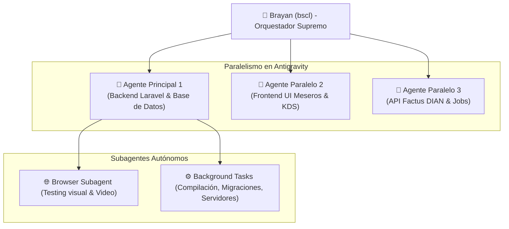

# ⚡ Multiagentes en Antigravity IDE — Flujo de Trabajo Exponencial

- **Área:** Productividad / Flujos Autónomos / Antigravity IDE
- **Relacionado:** [[Sistemas Multiagente (Arquitectura, Orquestacion y Patrones)]], [[Restaurante Bigpollo]], [[Perfil y Reglas de Trabajo (Brayan - bscl)]]

---

## 👥 ¿Cómo opera la arquitectura Multiagente en Antigravity?

Antigravity IDE no es un simple autocompletador pasivo; es un **centro de mando de agentes autónomos**. Opera en 3 niveles complementarios:

---

## 🚀 Los 3 Mecanismos de Multiagente en tu IDE

### 1. Sesiones Paralelas Aisladas (Tú como Director de Orquesta)
* Puedes hacer clic en **"New Conversation"** (+) en el menú lateral para abrir hilos de agentes simultáneos.
* **El superpoder:** En el Chat 1 me pones a crear las migraciones y modelos de base de datos de Big Pollo en la rama `development`. Al mismo tiempo, en el Chat 2 lanzas otro agente para diseñar la interfaz táctil del mesero en React/Blade.
* Ambos agentes trabajan en segundo plano en sus propios hilos sin bloquearte la pantalla.

### 2. Subagentes Internos y Tareas en Segundo Plano (Supervisor-Worker)
* Cuando una tarea es compleja, el agente principal invoca **Subagentes autónomos**:
  * **`browser_subagent`**: Abre un navegador real, navega a tu app (`http://localhost:8000`), hace clics, llena comandas y graba video en WebP como evidencia.
  * **`background tasks`**: Ejecuta servidores (`php artisan serve`), compila paquetes en segundo plano y te notifica cuando termina.

### 3. Comandos Slash de Alto Nivel
* `/goal`: El agente entra en modo implacable y no se detiene hasta que el objetivo completo esté 100% probado y funcionando.
* `/grill-me`: El agente te entrevista para resolver dudas de arquitectura antes de empezar a programar.
* `/schedule`: Programa tareas automáticas recurrentes o temporizadas.

---

## 🍗 Cómo aplicarlo de inmediato al Restaurante Big Pollo

Para multiplicar por 4x la velocidad de desarrollo de este SaaS:

| Agente / Hilo | Rol Asignado | Entregable Concreto |
| :--- | :--- | :--- |
| **Agente 1 (Nosotros aquí)** | Arquitectura & Base de Datos | Migraciones de Tenants, Mesas, Menú, Recetas y Pedidos en Laravel 11. |
| **Agente 2 (Hilo Paralelo)** | Frontend KDS & Mesero | Componentes visuales responsivos para comandas de cocina y toma de pedidos. |
| **Agente 3 (Hilo Paralelo)** | Integración Facturación DIAN | Service Provider de Factus, DTOs de facturas electrónicas y colas en segundo plano. |
| **Subagente QA** | Testing Autónomo | Levanta el servidor local, simula un pedido en el navegador y valida el flujo completo. |
