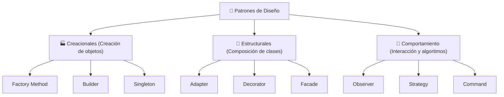

# 🧩 Patrones de Diseño (Gang of Four - GoF)

- **Área:** Arquitectura de Software y Código Reutilizable
- **Relacionado:** [[Clean Code y SOLID]], [[Arquitectura Limpia y Patrones de Arquitectura]]

---

## 🧭 Clasificación de Patrones

---

## 🏭 1. Patrones Creacionales

* **Factory Method / Abstract Factory:**
  - *Cuándo usar:* Cuando necesitas crear familias de objetos sin acoplar el código a sus clases concretas.
  - *Ejemplo:* Un sistema de notificaciones que crea instancias de `EmailNotifier`, `SMSNotifier` o `PushNotifier` según la preferencia del usuario.
* **Builder:**
  - *Cuándo usar:* Para construir objetos complejos con múltiples pasos o configuraciones opcionales sin constructores con 10 argumentos.
  - *Ejemplo:* `UserQueryBuilder.select().where().orderBy().limit().build()`.
* **Singleton:**
  - *Cuándo usar:* Garantiza una única instancia global de una clase (como un pool de conexiones de BD o gestor de configuración). *Nota: Usar con moderación para evitar acoplamiento oculto.*

---

## 🧱 2. Patrones Estructurales

* **Adapter (Adaptador):**
  - *Cuándo usar:* Permite que dos interfaces incompatibles trabajen juntas.
  - *Ejemplo:* Integrar una librería externa de pagos como Stripe envolviéndola en nuestra interfaz interna `PaymentGatewayInterface`.
* **Decorator (Decorador):**
  - *Cuándo usar:* Añade funcionalidades a un objeto dinámicamente sin alterar su estructura mediante herencia.
  - *Ejemplo:* Envolver un servicio de base de datos con un decorador de **Caching** o un decorador de **Logging**.
* **Facade (Fachada):**
  - *Cuándo usar:* Provee una interfaz simplificada hacia un subsistema complejo de múltiples clases.

---

## 🎯 3. Patrones de Comportamiento

* **Strategy (Estrategia):**
  - *Cuándo usar:* Define una familia de algoritmos intercambiables en tiempo de ejecución.
  - *Ejemplo:* Calcular costo de envío según la empresa elegida (`FedExStrategy`, `DHLStrategy`, `LocalExpressStrategy`).
* **Observer (Observador / Pub-Sub):**
  - *Cuándo usar:* Notifica automáticamente a múltiples observadores cuando el estado de un sujeto cambia.
  - *Ejemplo:* Eventos en JavaScript, reactividad con RxJS/Signals, o eventos de dominio (`OrderPlacedEvent`).
* **Command (Comando):**
  - *Cuándo usar:* Encapsula una solicitud como un objeto, facilitando operaciones como "Deshacer/Rehacer" (Undo/Redo), encolado de tareas o historial de transacciones.
* **State (Estado):**
  - *Cuándo usar:* Permite a un objeto alterar su comportamiento cuando su estado interno cambia (ej. una orden pasando por `Draft` -> `Paid` -> `Shipped` -> `Delivered`).
