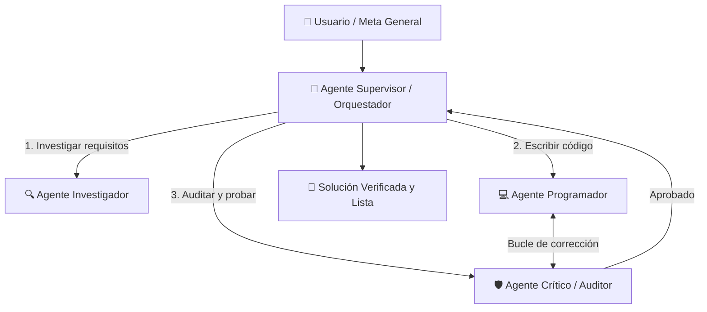

# 🤖 Sistemas Multiagente (Arquitectura, Orquestación y Patrones)

- **Área:** Inteligencia Artificial Avanzada / Sistemas Autónomos / Orquestación
- **Relacionado:** [[Gemini AI Ecosystem]], [[Colaboracion con IA (Antigravity)]], [[Redes Neuronales y Deep Learning]], [[00_Centro_de_Mando]]

---

## 👥 ¿Qué es un Sistema Multiagente (MAS)?

En lugar de depender de un único modelo de lenguaje que intente resolver un problema complejo de principio a fin, un **Sistema Multiagente** divide el trabajo entre un **equipo coordinado de agentes especializados**. Cada agente cuenta con:
1. **Un Rol y Personalidad definida (System Prompt).**
2. **Herramientas específicas (Tools / Funciones) a su disposición.**
3. **Memoria local y contexto restringido para evitar saturación de tokens.**
4. **Criterios claros de parada o traspaso.**

---

## 🏛️ Patrones de Topología y Orquestación

### 1. Patrón Jerárquico / Supervisor (Orchestrator-Workers)
* **Cómo funciona:** Un agente líder (como el orquestador principal de Antigravity) recibe la meta global, diseña un plan paso a paso, delega cada fase a agentes trabajadores independientes y consolida los resultados.
* **Ventaja:** Máximo control y coherencia global; evita que los agentes se desvíen del objetivo.

### 2. Patrón de Crítico / Verificador (Actor-Critic Loop)
* **Cómo funciona:** El agente programador genera una solución, y de inmediato un **Agente Crítico** (QA) analiza el código buscando fallos, bugs de rendimiento o violaciones de seguridad antes de confirmarlo.
* **Ventaja:** Reduce drásticamente las alucinaciones y eleva la calidad del código.

### 3. Coreografía de Pares / Swarm
* **Cómo funciona:** Los agentes se pasan el control entre sí de forma descentralizada según condiciones del entorno (ej. si el agente de ventas detecta una queja técnica, transfiere el contexto directamente al agente de soporte técnico).

---

## 🎭 Roles Típicos en un Equipo Multiagente

| Rol | Responsabilidad | Herramientas Típicas |
| :--- | :--- | :--- |
| **Orquestador / Planner** | Descompone metas complejas, asigna tareas y gestiona prioridades. | Gestión de tareas, evaluador de avance. |
| **Investigador (Researcher)** | Rastrea documentación, busca en la web y analiza repositorios. | Búsqueda web, lectura de PDFs, inspectores de código. |
| **Desarrollador (Coder)** | Escribe código limpio, refactoriza y genera componentes. | Editores de archivos, linters, shells de ejecución. |
| **Auditor / QA (Reviewer)** | Ejecuta tests, audita seguridad y valida contra requerimientos. | Frameworks de testing, terminales de prueba. |
| **Navegador Web (Browser Agent)** | Interactúa con interfaces web reales (clicks, navegación, formularios). | Headless browser (Puppeteer / Playwright). |

---

## 🛠️ Frameworks Populares para Crear Sistemas Multiagente

* **LangGraph (LangChain):**
  - Modela flujos como **grafos de estado cíclicos** (`StateGraph`).
  - Permite bucles condicionales, intervención humana (*Human-in-the-loop*) y persistencia de memoria mediante checkpoints con opción de "viaje en el tiempo" para depurar decisiones pasadas.
* **CrewAI:**
  - Paradigma muy intuitivo inspirado en tripulaciones de trabajo (*Crews*): defines `Agents`, `Tasks` y un `Process` (secuencial o jerárquico).
* **AutoGen (Microsoft):**
  - Especializado en conversaciones multi-turno entre agentes autónomos y humanos ejecutando código en entornos seguros tipo Docker.
* **El Enfoque Nativo de Antigravity:**
  - Invocación de subagentes especializados y paralelos con herramientas aisladas (ej. un subagente para controlar el navegador web y registrar video mientras el agente principal continúa orquestando el proyecto).

---

## ⚡ Buenas Prácticas para Evitar Bucles Infinitos y Alucinaciones

1. **Límites de Iteraciones (Max Turns):** Establecer siempre un número máximo de turnos (ej. máx. 5 intentos de corrección) para evitar bucles infinitos entre el programador y el crítico.
2. **Definición de Salida Estructurada:** Exigir que los agentes se comuniquen mediante esquemas **JSON estrictos** o Pydantic models.
3. **Pizarra de Estado Centralizada (Shared State):** Mantener un único objeto de verdad con las variables del proyecto para que ningún agente trabaje con datos obsoletos.
