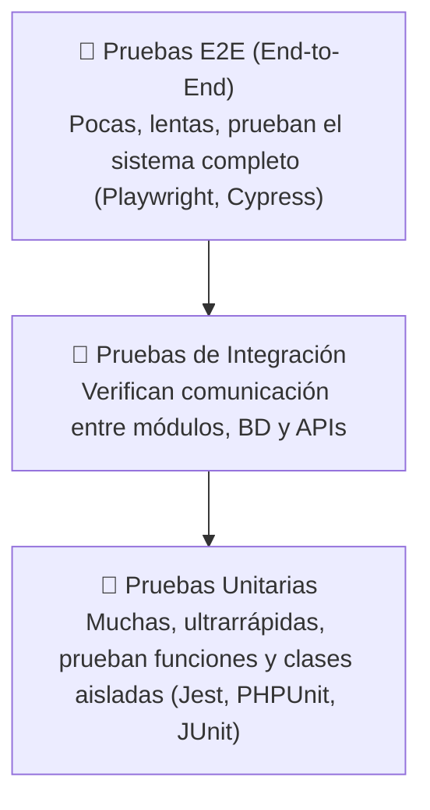

# 🧪 Testing & Calidad de Software

- **Área:** Automatización de Pruebas y Aseguramiento de Calidad (QA)
- **Relacionado:** [[Clean Code y SOLID]], [[Arquitectura Limpia y Patrones de Arquitectura]]

---

## 🔺 La Pirámide de Testing

* **Unitarias (Base de la pirámide - 70%):** Prueban la lógica interna de una función o método sin tocar bases de datos reales ni redes. Son baratas y se ejecutan en milisegundos.
* **Integración (Cuerpo - 20%):** Prueban cómo interactúa tu código con la base de datos, caché o servicios externos en un entorno controlado (usando contenedores Docker o SQLite en memoria).
* **E2E / End-to-End (Cúspide - 10%):** Simulan el comportamiento real del usuario en el navegador (click, scroll, login, compra).

---

## 🔄 TDD — Test-Driven Development

El ciclo virtuoso del desarrollo guiado por pruebas:

1. 🔴 **Red (Rojo):** Escribes una prueba que define lo que quieres lograr. Como la funcionalidad no existe aún, la prueba **falla**.
2. 🟢 **Green (Verde):** Escribes el código mínimo necesario para que la prueba **pase**. No te preocupes por la perfección todavía.
3. 🔵 **Refactor (Refactorizar):** Limpias el código, eliminas duplicación y aplicas [[Clean Code y SOLID]], con la tranquilidad de que las pruebas te garantizan que nada se rompe.

---

## 🎭 Dobles de Prueba (Test Doubles)

* **Dummy:** Objetos que se pasan solo para llenar la firma de un parámetro pero nunca se usan.
* **Stub:** Provee respuestas prefabricadas fijas a llamadas durante la prueba (ej. siempre devuelve `true` para `isAuthenticated()`).
* **Mock:** Objeto que registra expectativas sobre cómo debe ser llamado (ej. verificar que `emailSender.send()` fue invocado exactamente 1 vez con el destinatario correcto).
* **Fake:** Implementación funcional ligera no apta para producción (ej. base de datos en memoria o repositorio simulado con un array).

---

## 📊 Reglas para Pruebas Excelentes
* **FIRST:**
  - **F**ast (Rápidas)
  - **I**ndependent (Aisladas, el orden de ejecución no altera el resultado)
  - **R**epeatable (Dan el mismo resultado en cualquier entorno)
  - **S**elf-validating (Pasan o fallan con un booleano claro, sin revisión manual de logs)
  - **T**imely (Escritas a la par o antes del código de producción)
